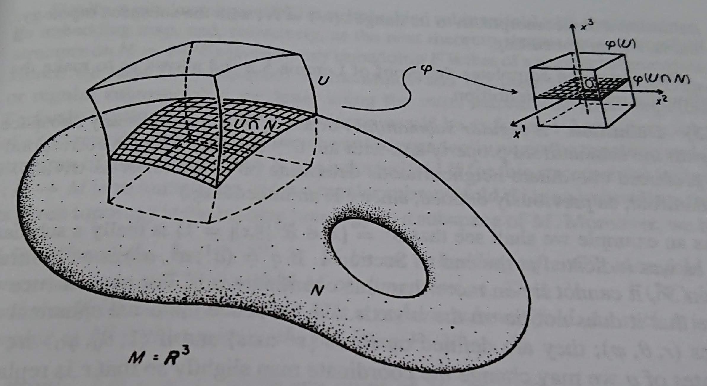

---
fontfamily: "libertine"
mainfont: "GFS Artemisa"
title: "General Relativity"
author: [Tae Geun Kim]
date: 2018-10-15
subject: "Markdown"
keywords: [Markdown, Example]
subtitle: "By precise approach"
titlepage: true
toc-own-page: true
...

\newpage\thispagestyle{empty}\null\newpage

\tableofcontents

# The Background Manifold Structure

\begin{tcolorbox}[colback=white!5!white,colframe=black!30!blue, title=\textbf{Def 1.1.0 \hs Topological Manifolds}]
  A \textit{manifold} $M$ of dimension $n$ is a topological space with the following properties.
  \begin{enumerate}
    \item $M$ is Hausdorff
    \item $M$ is locally Euclidean of dimension $n$
    \item $M$ has a countable basis of open sets
  \end{enumerate}
\end{tcolorbox}

**Why?**

* **Hausdorff** : In Hausdorff space, convergent sequences converge to only one point.
If you want to do calculus, you should need Hausdorff space.

* **Locally Euclidean** : This is the main reason that why we require manifolds.

* **Countable Basis** : We need *partition of unity* to bring many properties of Euclidean space.
For Hausdorff space, existence of partition of unity require *paracompactness*.
And paracompactness follows from *second countability*. It is same as have countable basis.

\VS

Now, we need some topological concepts to start *General Relativity*.
If you are not familiar with topology, first read *Appendix A*.

\newpage

## 1. Basic Concepts

\begin{tcolorbox}[colback=white!5!white,colframe=black!30!blue, title=\textbf{Def 1.1.1 \hs Connected}]
  If it is not possible to write $M = A \cup B$ with, $A,B \in \mathcal{T}$ and $A \cap B = \emptyset$
  then $M$ is \textit{connected}.
\end{tcolorbox}

\vs

\begin{tcolorbox}[colback=white!5!white,colframe=black!30!blue, title=\textbf{Def 1.1.2 \hs Hausdorff}]
  If $M$ is connected \& $\forall \, p, q \in M$, there are open neighborhoods $\mcu(p) \ni p$, $\mcu(q) \ni q$
  such that $\mcu(p) \cap \mcu(q) = \emptyset$ then $M$ is \textit{Hausdorff}.
\end{tcolorbox}

\vs

\begin{tcolorbox}[colback=white!5!white,colframe=black!30!blue, title=\textbf{Def 1.1.3 \hs Cover}]
  A family $\Mbk{\mcu_\alpha}_{\alpha \in A}$ of open sets of $M$ is called \textit{open cover of $M$} if 
  $$\bigcup_{\alpha \in A}\mcu_\alpha = M$$
\end{tcolorbox}

\vs

\begin{tcolorbox}[colback=white!5!white,colframe=black!30!blue, title=\textbf{Def 1.1.4 \hs Compact}]
  $M$ is \textit{compact} if $M$ is Hausdorff and all open cover of $M$ has finite refinement of $M$.
\end{tcolorbox}

\vs

\begin{tcolorbox}[colback=white!5!white,colframe=black!30!blue, title=\textbf{Def 1.1.5 \hs Paracompact}]
  $M$ is \textit{paracompact} if all open cover of $M$ has locally finite refinement.
\end{tcolorbox}

## 2. Maps

\begin{tcolorbox}[colback=white!5!white,colframe=black!30!blue, title=\textbf{Def 1.2.1 \hs Important Maps}]
  Given two sets $U, U'$ a map $\Phi: U \rightarrow U'$ is called
  \begin{itemize}
    \item \textit{Injective} : $\forall p' \in \Phi(U)$, $~ \exists! p \in U$ such that $\Phi(p) = p'$.
    \item \textit{Surjective} : $\Phi(U) = U'$.
    \item \textit{Bijective} : $\Phi$ is both injective and surjective.
  \end{itemize}
\end{tcolorbox}

\begin{tcolorbox}[colback=white!5!white,colframe=black!30!blue, title=\textbf{Def 1.2.2 \hs Continuous}]
  Consider $(U, \mathcal{T}),~(U', \mathcal{T}')$ are topological spaces.
  $\Phi: U \rightarrow U'$ is said to be \textit{continuous} at a point $p \in U$
  if $\Phi^{-1}(W')$ is a neighborhood of $p$ for any neighborhood $W'$ of
  $\Phi(p) \in U'$.
\end{tcolorbox}

\newpage

\begin{tcolorbox}[colback=white!5!white,colframe=black!30!blue, title=\textbf{Def 1.2.3 \hs Homeomorphism}]
  If $\Phi : U \rightarrow U'$ is bijective and $\Phi, \Phi^{-1}$ are continuous
  then $\Phi$ is called homeomorphism and $U,U'$ are homeomorphic.
\end{tcolorbox}

## 3. Coordinate Neighborhoods (Chart)

\begin{tcolorbox}[colback=white!5!white,colframe=black!30!blue, title=\textbf{Def 1.3.1 \hs Coordinate Neighborhood (Chart)}]
  Given a topological space $(M, \mathcal{T})$, define \textit{chart} of $M$ to be a pair $(\mcu_\alpha, \varphi_\alpha)$,
  with $\mcu_\alpha$ an element of $\mathcal{T}$ and $\varphi_\alpha$ a homeomorphism of $\mcu_\alpha$
  onto an open set of $\R^n$.
\end{tcolorbox}

We usually use next notation:

\begin{itemize}
  \item \textit{Point on a manifold} : $p \in M$
  \item \textit{Local coordinate of point} : $\varphi(p) = (x^1, \cdots, x^n) = x$
\end{itemize}

\VS

\begin{tcolorbox}[colback=white!5!white,colframe=black!30!blue, title=\textbf{Def 1.3.2 \hs Atlas}]
  A familiy of charts $\mathcal{A} = \Mbk{(\mcu_\alpha, \varphi_\alpha)}_{\alpha \in A}$ on $M$
  is said to form an \textit{atlas} on $M$ if $\displaystyle\bigcup_{\alpha \in A}\mcu_\alpha = M$.
\end{tcolorbox}

\vs

\begin{tcolorbox}[colback=white!5!white,colframe=black!30!blue, title=\textbf{Def 1.3.3 \hs Coordinate Transform}]
  Let $(\mcu_\alpha, \varphi_\alpha),~(\mcu_\beta, \varphi_\beta)$ be two charts on $M$
  with $\mcu_\alpha \cap \mcu_\beta \neq \emptyset$. For a point $p \in \mcu_\alpha \cap \mcu_\beta$,
  a map (trivial homeomorphism) 
  $$\varphi_\beta \circ \varphi_\alpha^{-1}:~\varphi_\alpha(\mcu_\alpha \cap \mcu_\beta) \rightarrow \varphi_\beta (\mcu_\alpha \cap \mcu_\beta)$$
  is called \textit{Coordinate Transform}.
\end{tcolorbox}

\vs

\begin{tcolorbox}[colback=white!5!white,colframe=black!30!blue, title=\textbf{Def 1.3.4 \hs $\mathbf{C^r}$-atlas}]
  An atlas on $M$ is $C^r\textit{-atlas}$ if $\varphi_\beta \circ \varphi_\alpha^{-1}$ and its inverse for any pair $(\alpha, \beta)$
  are $\R^n$ valued $C^r$-functions.
\end{tcolorbox}

\newpage

## 4. Differentiable Manifolds

\begin{tcolorbox}[colback=white!5!white,colframe=black!30!blue, title=\textbf{Def 1.4.1 \hs Differentiable Manifold}]
  \textit{Differentiable Manifold} of class $C^r$ and dimension $n$ is a Hausdorff topological space
  with a $C^r$-atlas.
\end{tcolorbox}

We denote differentiable manifold as $(M, \mathcal{A})$ where $\mathcal{A}$ is $C^r$-atlas.

\VS

\begin{tcolorbox}[colback=white!5!white,colframe=black!30!blue, title=\textbf{Def 1.4.2 \hs Function of Manifold}]
  A map $f: M \rightarrow \R$ is said to be $C^k$-function at $p\in M$,
  if for any chart $(\mcu_\alpha, \varphi_\alpha)$ containing $p$, there exists open neighborhood $\mcu(p) \subset \mcu_\alpha$ of $p$
  such that the composite map
  $$ \tilde{f}_{\alpha}: \R^n \supset \varphi_\alpha(\mcu(p)) \rightarrow \R$$
  defined by
  $$ \tilde{f}_{\alpha}(x) \equiv f \circ \varphi_\alpha^{-1}(x),~ x \in \R^n $$
  is a $C^k$-differentiable function.
\end{tcolorbox}

We can't define differentiability of $f$ directly. But with chart, we can find $\R^n$ valued function
that we already know how to determine differentiability in multi-variable real analysis.
So, by using it, we can consider differentiability of $f$.

\VS

\begin{tcolorbox}[colback=white!5!white,colframe=black!30!blue, title=\textbf{Def 1.4.3 \hs Function Space}]
  Denote by $\mathcal{F}$ the set of all differentiable functions on $M$ with the internal operations.
  \begin{enumerate}
    \item \textit{Multiplication} : $fg(p) = f(p)g(p)$
    \item \textit{Addition} : $(f + g)(p) = f(p) + g(p)$
  \end{enumerate}
\end{tcolorbox}

It's easy to find $\mathcal{F}$ is an \textit{Abelian Ring}.

\newpage

## 5. Maps of Manifolds

\begin{tcolorbox}[colback=white!5!white,colframe=black!30!blue, title=\textbf{Remark \hs Manifold with $\R^n$}]
  A manifold $M$ is locally homeomorphic to an open set of $\R^n$.
\end{tcolorbox}

\begin{tcolorbox}[colback=white!5!white,colframe=black!30!blue, title=\textbf{Def 1.5.1 \hs Maps between Manifolds}]
  Let $M,N$ be two differentiable manifolds with same dimension $n$ and $\psi: M \rightarrow N$
  a map of $M$ into $N$. Suppose two points $p \in M$, $~p' \in N$ such that $\psi(p) = p'$.
  Let $(\mcu_\alpha, \varphi_\alpha)_p$, $~(\mcu'_\beta, \varphi'_\beta)_{p'}$ be two charts such that
  $\varphi_\alpha(p) = x \in \R^n,~ \varphi'_\beta(p') = x' \in \R^n$.
  By definition, $x' = \varphi'_\beta \circ \psi \circ \varphi_\alpha^{-1}(x)$.
  We call it by \textit{coordinate representation} of $\psi$ and denote by
  $$ \tilde{\psi}_{\alpha\beta}(x) = \varphi'_\beta \circ \psi \circ \varphi_\alpha^{-1}(x)$$
\end{tcolorbox}

Similar to $f$, we also determine differentiability of $\psi$ using by $\tilde{\psi}_{\alpha\beta}$.

\VS

\begin{tcolorbox}[colback=white!5!white,colframe=black!30!blue, title=\textbf{Def 1.5.2 \hs Diffeomorphism}]
  If the map $\psi: M \rightarrow N$ is homeomorphism with both $\psi,~\psi^{-1}$ are differentiable,
  then $\psi$ is called \textit{Diffeomorphism}.
\end{tcolorbox}

There are some kinds of Maps.

\VS

\begin{tcolorbox}[colback=white!5!white,colframe=black!30!blue, title=\textbf{Def 1.5.4 \hs Immersion}]
  If $\text{dim}(M) > \text{dim}(N)$, a $C^r$-map $\Phi: N \rightarrow M$ is said to be an \textit{immersion}
  if it is locally injective and the image of $\Phi(N)$ is said to be a $m$-dimensional \textit{immersed submanifold} of $M$
  
  The set $\Phi(N)$ is said to be \textit{imbedded} in $M$ if $\Phi$ is a homeomorphism of $N$
  into its image in $M$, with the induced topology of $M$.
\end{tcolorbox}

\begin{tcolorbox}[colback=white!5!white,colframe=black!30!blue, title=\textbf{Def 1.5.5 \hs Hypersurface}]
  An imbedded submanifold of $M$ with $m = \text{dim}(M) - 1$ is termed a \textit{hypersurface}.
\end{tcolorbox}

\newpage

## 6. The Tangent Space

To define tangent vector, we should define curve first.

\begin{tcolorbox}[colback=white!5!white,colframe=black!30!blue, title=\textbf{Def 1.6.1 \hs Curve}]
  Given manifold $M$, a \textit{curve} $\gamma$ in $M$ is a map with single parameter:
  $$ \gamma : \R \rightarrow M $$
\end{tcolorbox}

Now we can define tangent vector.

\begin{tcolorbox}[colback=white!5!white,colframe=black!30!blue, title=\textbf{Def 1.6.2 \hs Tangent Vector}]
  The \textit{tangent vector} to a curve $\gamma$ at a point $p=\gamma(t)$ is a map $\dot{\gamma}_p : \mathcal{F}(M) \rightarrow \R$
  is given as
  $$\dot{\gamma}_p(f) = \frac{d}{dt}\Bbk{f\circ \gamma(t)}_{\gamma^{-1}(p)}, \HS f \in \mathcal{F}(M)$$
\end{tcolorbox}

We define tangent vector as a map. It's so weird. Let's rationalize this on $\R^n$.

\vs

\begin{tcolorbox}[colback=white!5!white,colframe=black!30!blue, title=\textbf{Def 1.6.3 \hs Derivation Operator}]
  Let $M$ be a differentiable manifold, $p \in M$. We say that a linear function $D \in \mathcal{F}^*(M)$
  defined on $\mathcal{F}(M)$ is a \textit{derivation} of $\mathcal{F}(M)$ at $p$
  if the equality
  $$D(fg) = D(f)g(p) + f(p)D(g)$$
  holds for $\forall f,g \in \mathcal{F}(M)$.
\end{tcolorbox}

We denote space of derivation operators as $\mathcal{D}_p(M)$. For $\R^n$, denote $D_p(\R^n)$
as set of all derivations of $C^{\infty}(p)$ to $\R$.

\begin{tcolorbox}[colback=white!5!white,colframe=black!30!blue, title=\textbf{Lem 1.6.4 \hs Constant Derivation}]
  Let $D \in \mathcal{D}_p(M)$. Then $D=0$ for all $f \in \mathcal{F}(M)$ such that
  $f$ is constant in a neighborhood of $p$.
\end{tcolorbox}

\begin{tcolorbox}[colback=white!5!white,colframe=black!30!red, title=\textbf{Proof for Lem 1.6.4}]
  $$D 1 = D (1 \cdot 1) = D 1 \cdot 1 + 1 \cdot D 1 = 2 D 1 \Rightarrow D 1 = 0 \Rightarrow D c = c\cdot D 1 = 0$$
  \hspace*{\fill} $\blacksquare$
\end{tcolorbox}

\newpage

\begin{tcolorbox}[colback=white!5!white,colframe=black!30!blue, title=\textbf{Lem 1.6.5 \hs First Order Approximation}]
  Let $f(x^1, \cdots x^n)$ be defined and $C^\infty$ on some open set $U$.
  If $p \in U$, then $\exists$ spherical neighborhood $\mathcal{B}(p)$ of $p$ such that
  $\mathcal{B}(p) \subset U$ and $C^\infty$ function $g^1, \cdots , g^n$ on $\mathcal{B}(p)$ such that

  \VS
  
  \begin{enumerate}
    \item $g^i(p) = \Sbk{\PD{f}{x^i}}$
    \item $\displaystyle f(x) = f(p) + \sum_{i=1}^n(x^i - p^i)g^i(x)$
  \end{enumerate}
\end{tcolorbox}

\begin{tcolorbox}[colback=white!5!white,colframe=black!30!red, title=\textbf{Proof for Lem 1.6.5}]
  Consider next integration.
  $$\int_0^1 \PD{}{t} f(p + t(x-p)) dt = f(x) - f(p)$$
  Thus,toc-own-page: true
  $$f(x) = f(p) + \sum_{i=1}^n (x^i - p^i)\int_0^1\Bbk{\PD{f}{x^i}}_{p+t(x-p)}dt$$
  So, choose 
  $$g^i(x) = \int_0^1\Bbk{\PD{f}{x^i}}_{p+t(x-p)}dt$$
  Then it satisfies \textit{Lem 1.6.5}.
  \hspace*{\fill} $\blacksquare$
\end{tcolorbox}

And review directional derivative.

\begin{tcolorbox}[colback=white!5!white,colframe=black!30!blue, title=\textbf{Def 1.6.6 \hs Directional Derivative}]
  Let $X_p \in T_p(\R^n)$ such that
  $$X_p = \sum_{i=1}^n \alpha^i E_{ip}$$
  Then we can define a linear map $X_p^*: \, C^\infty(p) \rightarrow \R$ as
  $$X_p^*(f) = \sum_{i=1}^n \alpha^i \Sbk{\PD{f}{x^i}}_p $$
  This map is called \textit{Directional Derivative}.
\end{tcolorbox}

Trivially, we know there is 1-1 correspondence between $X_p,~X_p^*$.
If we define space of directional derivatives, then this space has same dimension as $T_p(\R^n)$.
Thus, they are isomorphic.

\newpage

\begin{tcolorbox}[colback=white!5!white,colframe=black!30!blue, title=\textbf{Thm 1.6.7 \hs Tangent Vector \& Derivative}]
  $T_p(\R^n)$ is isomorphic to $\mathcal{D}_p(\R^n)$.
\end{tcolorbox}

\begin{tcolorbox}[colback=white!5!white,colframe=black!30!red, title=\textbf{Proof of Thm 1.6.7}]
  We already know relation between $X_p,~X_p^*$. Thus, our claim is as follow:
  $$\forall D \in \mathcal{D}_p(\R^n),~\exists X_p \in T_p(\R^n)~\text{such that}~X_p^*f = Df$$
  By \textit{Lem 1.6.5}, $\exists g$ such that
  $$f(x) = f(p) + \sum_{i=1}^n (x^i - p^i)g^i(x), ~~~ g^i(p) = \Sbk{\PD{f}{x^i}}_p$$
  Then let's use $D$ both side,
  \begin{align*}
    Df &= D(f(p)) + \sum_{i=1}^n D(x^i - p^i)g^i(p) + \sum_{i=1}^n (p^i - p^i)D(g^i(x))\\
    &= \sum_{i=1}^n D(x^i)\Sbk{\PD{f}{x^i}}_p
  \end{align*}
  Since $D(x^i) \in \R$, let $\alpha^i \equiv D(x^i)$ then proof is complete.
  \hspace*{\fill} $\blacksquare$
\end{tcolorbox}

By \textit{Thm 1.6.7}, we can identify $T_p(\R^n)~ \& ~\mathcal{D}_p(\R^n)$.
It means we can identify canonical basis and directional derivative.
Thus, from now, we use directional derivative ways rather than canonical basis.

\VS

Then let's get back to original definition.

\newpage

Now, let's obtain coordinate representation of tangent vector.
\begin{align*}
  \dot{\gamma}_p(f) &= \frac{d}{dt}\Bbk{f\circ \gamma(t)}_{\gamma^{-1}(p)}\\
  &= \frac{d}{dt}\Bbk{f \circ \varphi^{-1}\circ \varphi \circ \gamma(t)}_{\gamma^{-1}(p)} \\
  &= \Sbk{\frac{dx^i}{dt}}\Sbk{\PD{\tilde{f}}{x^i}}_{\varphi(p)}
\end{align*}

We want to decompose tangent vector to component and basis. But we can't find directly.
So, we need some awesome tool - \textit{push forward}.

\vs

\begin{tcolorbox}[colback=white!5!white,colframe=black!30!blue, title=\textbf{Def 1.6.8 \hs Tangent Map (Push forward)}]
  Let $M,N$ be two manifolds and $\Phi: M \rightarrow N$ be a map of $M$ into $N$.
  The induced vectors in $N$ are given by maps:
  $$\Phi_*(u): \mathcal{F}(N) \rightarrow \R, ~~~ u \in T_p(M)$$
  defined by
  $$\Phi_*(u)(f) = u(f \circ \Phi), ~~~ f \in \mathcal{F}(N)$$
  This map is called \textit{Tangent map} and also called \textit{Push forward}.
\end{tcolorbox}

By *Def 1.6.8*, we can decompose tangent vector to components & bases.
\begin{align*}
  \dot{\gamma}_p(f) &= \Sbk{\frac{dx^i}{dt}}_{\gamma^{\text{-}1}(p)}\Sbk{\PD{\tilde{f}}{x^i}}_{\varphi(p)} \\
  &= \Sbk{\frac{dx^i}{dt}}_{\gamma^{\text{-}1}(p)} \Sbk{\PD{}{x^i}}_{\varphi(p)}\Sbk{f \circ \varphi^{-1}} \\
  &= \Sbk{\frac{dx^i}{dt}}_{\gamma^{\text{-}1}(p)} \Sbk{\varphi^{-1}_* \Sbk{\PD{}{x^i}}}_p f
\end{align*}

Since $\Sbk{\varphi^{-1}_* \Sbk{\PD{}{x^i}}}_p$ is basis for $T_p(M)$, finally we can get next expression.
$$ \dot{\gamma}_p = \Sbk{\frac{dx^i}{dt}}_{\gamma^{\text{-}1}(p)} \Sbk{\varphi^{-1}_* \Sbk{\PD{}{x^i}}}_p \equiv \dot{\gamma}_p^i \partial_i$$

$\dot{\gamma}_p^i$ is called *component* of tangent vector, $\partial_i$ is called *basis* of tangent vector.

Now, let's see transformation properties of vector components.

\newpage

\begin{tcolorbox}[colback=white!5!white,colframe=black!30!blue, title=\textbf{Def 1.6.9 \hs Change Basis}]
  Let $\Mbk{e_i}, \{e_j'\}$ are two bases of $T_p(M)$. From the properties of a basis, we can describe change basis as follows:
  $$ e_i' = \tensor{A}{_i^j}e_j$$
  where $\tensor{A}{_i^j}$ form an $n\times n$ matrix of real numbers such that
  $$ \tensor{A}{_i^j} \tensor{{A^{\text{-}1}}}{_j^k} = \delta^k_i$$
\end{tcolorbox}

Let's use change of basis for our tangent vector. Let choose two bases $\Mbk{e_i}, \{e_j'\}$. Then for tangent vector $u \in T_p(M)$,
$$u = u^ie_i = {u'}^i e'_i$$

It's easy to find next relation.
$$({u'}^i\tensor{A}{_i^j} - u^j)e_j = 0$$

By linearly indendence of bases, we can get
$${u'}^i = u^j \tensor{{A^{\text{-}1}}}{_j^i}$$

Transpose both side, we finally see
$${u'}^i = \tensor{\Sbk{A^{\text{-}1}}}{^i_j}u^j$$

\begin{tcolorbox}[colback=white!5!white,colframe=black!30!blue, title=\textbf{Def 1.6.10 \hs Contravariant Vector}]
  Suppose change of basis is given as
  $$e'_i = \tensor{A}{_i^j}e_j$$
  If change of basis of vector $u$ is given as
  $${u'}^i = \tensor{\Sbk{A^{\text{-}1}}}{^i_j}u^j$$
  then vector $u$ is called \textit{contravaiant vector}.
\end{tcolorbox}

\VS

**Exercise 1.6.1**: Prove that $\Phi_*(\dot{\gamma}_p) = \dot{\Sbk{\Phi \circ \gamma}}_{\Phi(p)}$

\newpage

## 7. The Cotangent Space

\begin{tcolorbox}[colback=white!5!white,colframe=black!30!blue, title=\textbf{Def 1.7.1 \hs Differential}]
  Let $f \in \mathcal{F}(M)$. The \textit{differential} of $f$ at $p$ is the map
  $$ df_p : T_p(M) ~ \rightarrow ~ \R$$
  such that
  $$df_p(u) = u(f)~~~ \forall u \in T_p(M)$$
\end{tcolorbox}

\vs

**Exercise 1.7.1**: Prove that differential is linear.

\VS

\begin{tcolorbox}[colback=white!5!white,colframe=black!30!blue, title=\textbf{Def 1.7.2 \hs Cotangent Space}]
  The set of all linear maps from $T_p(M)$ into $\R$ is called the \textit{cotangent space} at $p$.
  It is denoted by $T_p^*(M)$ and its general elements are \textit{covectors}.
  In fact, this space is the dual of $T_p(M)$.
\end{tcolorbox}

We denote covector as follows:
$$\omega = \omega_i e^i ~~~ \text{where} ~ \omega_i \in \R, ~ e^i \in T_p^*(M)$$

Although one can choose an arbitrary basis in $T_p^*(M)$, it's convenient to link its choice uniquely
to that of a basis in the tangent space. - \textit{Dual basis}
$$ e^i(e_j) = \delta^i_j$$

\begin{tcolorbox}[colback=white!5!white,colframe=black!30!blue, title=\textbf{Prop 1.7.3 \hs Properties of Covector}]
  \begin{itemize}
    \item Component: $e^i(u) = u^k e^i(e_k) = u^i ~~~ \forall u \in T_p(M)$
    \item Re-Analyze: $\omega(u) = u^k \omega(e_k) = \omega(e_k)e^k(u)~\Rightarrow~\omega = \omega(e_k)e^k = \omega_k e^k$
    \item Natural Basis: $dx^i (\partial_j) = \partial_j(x^i) = \PD{x^i}{x^j} = \delta^i_j ~\rightarrow~dx^i$ is a natural basis for $T_p^*(M)$.
    \item Component of differential: $(df)_i = (df)(\partial_i) = \partial_i(f) = \PD{\tilde{f}_\alpha}{x^i}~~~\forall f \in \mathcal{F}(M)$
  \end{itemize}
\end{tcolorbox}

\vs

By above properties, we can find any covector can be written as the differential of some function.

\newpage

We already know $e_i' = \tensor{A}{_i^j}e_j$. Now, let's see transformation of bases in $T_p^*(M)$. \newline
Let $\Mbk{e'^j},~\Mbk{e^k}$ be two bases of $T_p^*(M)$.
$$e'^j(e'_k) = \delta^j_k ~\Rightarrow~\tensor{A}{_k^i}e'^j(e_i) = \delta^j_k~\Rightarrow~e'^j(e_l) =
\tensor{\Sbk{A^{\text{-}1}}}{_l^j} = \delta^k_l\tensor{\Sbk{A^{\text{-}1}}}{_k^j}e^k(e_l)$$
Therefore, we can get next two results.
\begin{gather*}
  e'^j = \tensor{\Sbk{A^{\text{-}1}}}{_k^j}e^k \\
  \omega_i' = \tensor{A}{_i^j}\omega_j
\end{gather*}

This change of component is same as change of coordinate basis. We call this kinds of vector by \textit{Covariant vector}.

Finally, let's see the dual tangent map.

\begin{tcolorbox}[colback=white!5!white,colframe=black!30!blue, title=\textbf{Def 1.7.4 \hs Dual Tangent Map (Pull Back)}]
  Let $\Phi: M \rightarrow N$. Now we define \textit{the dual tangent map} $\Phi^*: \, T_{\Phi(p)}^*(N) \rightarrow T_p^*(M)$ as
  $$\Sbk{\Phi^*(\omega)}(u) = \omega\Sbk{\Phi_*(u)} ~~~ \forall u \in T_p(M)$$
\end{tcolorbox}

\vs

**Exercise 1.7.2**: Prove that $\Phi^*(df) = d(f \circ \Phi)$.

\newpage

[comment]: <> (
  ==============================================================
    Submanifolds //SECTION Lie Group
  ==============================================================
)

## 8. Lie Group

\begin{tcolorbox}[colback=white!5!white,colframe=black!30!blue, title=\textbf{Def 1.8.1 \hs Lie Group}]
  $G$ is a \textit{Lie group} provided that the mapping of $G\times G \rightarrow G$ defined by $(x,y) \rightarrow xy$
  and the mapping of $G \rightarrow G$ defined by $x \rightarrow x^{-1}$ are both $C^\infty$ mappings.
\end{tcolorbox}

\vs

\begin{tcolorbox}[colback=white!5!white,colframe=black!30!blue, title=\textbf{Example 1.8.2 \hs General Linear Group}]
  $Gl(n,\R)$, the set of nonsingular $n\times n$ matrices, is a group with respect to matrix multiplication.
  Since $AB$ is polynomial in the entries of $A,B$, the map $(A,B)\rightarrow AB$ is $C^\infty$. 

  And for $A^{-1} = \frac{1}{det{A}}\tilde{a}_{ij}$, since cofactor of $A$ is polynomial in the entries of $A$ and $det(A)\neq 0$,
  entries of $A^{-1}$ are rational functions on $Gl(n,\R)$ with non-vanishing denominator. Thus, the map $A\rightarrow A^{-1}$ is also $C^\infty$.
  \newline
  Therefore, $Gl(n,\R)$ is a Lie group.
\end{tcolorbox}

\vs

\begin{tcolorbox}[colback=white!5!white,colframe=black!30!blue, title=\textbf{Example 1.8.3 \hs Nonzero Complex Number}]
  Let $C^*$ be the nonzero complex numbers. Then $C^*$ is a group with respect to multiplication of complex numbers, the inverse being
  $z^{-1}=\frac{1}{z}$. 

  Moreover $C^*$ is a two-dimensional $C^\infty$ manifold covered by a single coordinate neighborhood $U=C^*$ with coordinate map
  $z \rightarrow \varphi(z)$ given by $\varphi(x + iy) = (x,y)$ for $z = x+iy$.

  Using these coordinates, the map $(z, z') \rightarrow zz'$ is given by
  $$((x,y),(x',y')) \rightarrow (xx' - yy', xy' + yx')$$
  and the mapping $z \rightarrow z^{-1}$ by
  $$(x,y)\rightarrow \Sbk{\frac{x}{x^2 + y^2},\frac{-y}{x^2 + y^2}}$$

  We can find these two maps are $C^\infty$. Thus, $C^*$ is Lie group.
\end{tcolorbox}

\VS

**Exercise 1.8.1**: Show that if $G_1,G_2$ are Lie groups then the direct product $G_1 \times G_2$ of 
this groups with the $C^\infty$ structure of the Cartesian product of manifolds is a Lie group.

\newpage

\begin{tcolorbox}[colback=white!5!white,colframe=black!30!blue, title=\textbf{Example 1.8.4 \hs Toral Groups}]
  The circle $S^1$ may be identified with the complex numbers of absolute value $+1$.
  Since $|z_1\, z_2| = |z_1|\,|z_2|$, it is a group with respect to multiplication of complex numbers $-$ a subgroup of $C^*$.

  Thus, $S_1$ is also Lie group and by previous \textit{Exercise 1.8.1}, we can see that $T^n = S^1 \times \cdots \times S^1$ is also Lie group.
  It is called the \textit{toral group}.
\end{tcolorbox}

As might be expected, the subgroups of a Lie group which are also submanifolds play a special role.

\begin{tcolorbox}[colback=white!5!white,colframe=black!30!blue, title=\textbf{Def 1.8.5 \hs Submanifold}]
  A subset $N$ of a $C^\infty$ manifold $M$ is said to have the $n$-\textit{submanifold property}
  if each $p \in N$ has a coordinate neighborhood $U,\varphi$ on $M$ with local coordinates $x^1,\cdots,x^m$ such that

  \begin{enumerate}
    \item $\varphi(0) = (0,\cdots,0)$
    \item $\varphi(U) = C_\epsilon^m(0)\footnote[1]{$m$-dimensional cube with center zero and breadth $\epsilon$}$
    \item $\varphi(U\cap N) = \Mbk{x \in C_\epsilon^m(0) \,|\, x^{n+1}=\cdots =x^m=0}$
  \end{enumerate}

  If $N$ has this property, coordinate neighborhoods of this type are called \textit{preferred} coordinates.
\end{tcolorbox}

Our interest is not general submanifold - *Regular submanifold*.

\newpage

\begin{tcolorbox}[colback=white!5!white,colframe=black!30!blue, title=\textbf{Def 1.8.6 \hs Regular Submanifold}]
  A \textit{regular submanifold} of a $C^\infty$ manifold $M$ is any subspace $N$ with the $C^\infty$ structure
  that the corresponding preferred coordinate neighborhoods determine on it.
\end{tcolorbox}

In Lie group, there is an important theorem for regular submanifold.

\vs

\begin{tcolorbox}[colback=white!5!white,colframe=black!30!blue, title=\textbf{Thm 1.8.7 \hs Lie group \& Regular submanifold}]
  Let $G$ be a Lie group and $H$ a subgroup which is also a regular submanifold. 
  Then with its differentiable structure as a submanifold $H$ is a Lie group.
\end{tcolorbox}

To prove above theorem, we require following lemma.

\vs

\begin{tcolorbox}[colback=white!5!white,colframe=black!30!blue, title=\textbf{Lem 1.8.8 \hs Regular submanifold \& Differentiable Map}]
  Let $F:A\rightarrow M$ be a $C^\infty$ mapping of $C^\infty$ manifolds and suppose $F(A)\subset N$,
  $N$ being a regular submanifold of $M$. Then $F$ is $C^\infty$ as a mapping into $N$.
\end{tcolorbox}

\begin{tcolorbox}[colback=white!5!white,colframe=black!30!red, title=\textbf{Proof for Lem 1.8.8}]
  Since $N$ is regular submanifold of $M$, each point of $N$ in preferred coordinate neighborhood.
  Let $p \in A$, $~q = F(p) \in N$ and $(U,\varphi)$ be a coordinate neighborhood of $p$,
  $~(V, \psi)$ be a coordinate of $q$. Then we can find next properties from definition of submanifold.
  \begin{enumerate}
    \item $\psi(q) = (0,\cdots,0)$
    \item $\psi(V) = C_\epsilon^m(0)$
    \item $\psi(V\cap N) = \Mbk{x \in C_\epsilon^m(0) \,|\, x^{n+1}=\cdots =x^m=0}$
  \end{enumerate}

  Let consider coordinate representation of $F$:
  \begin{gather*}
    \tilde{F} = \psi \circ F \circ \varphi^{-1}\\
    \tilde{F}(x^1, \cdots, x^l) = (f^1(x),f^2(x), \cdots ,f^n(x), 0, \cdots, 0)
  \end{gather*}

  since $F(A) \subset N$, $~\psi \circ F(U) \subset V \cap N$. 
  We can find $(V\cap N,\,\pi\circ\psi|_{V\cap N}\footnote[1]{$\pi$ is projection operator from $\R^m$ to $\R^n$.})$ is a coordinate neighborhood of $q$ on $N$.
  Thus, we can consider $F$ as a mapping into $N$, is given in local coordinates by
  $$(x^1,\cdots,x^l) ~\rightarrow ~(f^1(x), \cdots,f^n(x))$$
  Since $\pi$ is also differentiable, $F$ is $C^\infty$ map into $N$.
  \hspace*{\fill} $\blacksquare$
\end{tcolorbox}

\newpage

\begin{tcolorbox}[colback=white!5!white,colframe=black!30!red, title=\textbf{Proof for Thm 1.8.7}]
  Since $H$ is regular submanifold of $G$,
  it's easy to see $H\times H$ is a regular submanifold of $G\times G$.
  Thus, inclusion map\footnote[1]{$\iota(x) = x$} $F_1: H\times H \rightarrow G \times G$
  is a $C^\infty$ imbedding. If $F_2: G\times G \rightarrow G$ is the $C^\infty$ mapping
  $(g,g')~\rightarrow ~gg'$ and $F=F_2 \circ F_1$, then $F$ is a $C^\infty$ mapping from 
  $H\times H \rightarrow G$ with image in $H$ since $H$ is subgroup. By \textit{Lem 1.8.8}, $F$ can be considered
  as $C^\infty$ mapping from $H\times H$ into $H$. Similarly, let take a map from $H$ to $G$ such that
  $F'(h) = h^{-1}$ then its image is onto $H$. Thus, by \textit{Lem 1.8.8}, it is also $C^\infty$ mapping.
  Therefore the regular submanifold $H$ of $G$ is also Lie group.
  \hspace*{\fill} $\blacksquare$
\end{tcolorbox}

Now, using \textit{Thm 1.8.7}, we can find natural defined maps of a Lie group $G$ onto itself.
\begin{enumerate}
  \item $x \rightarrow x^{-1}$
  \item Left and right translations: $L_a(x)=ax,~R_a(x)=xa$
\end{enumerate}
These maps are $C^\infty$ by definition of Lie group and their inverses are also $C^\infty$.
So, they are, in fact, \textit{diffeomorphisms}.

\VS

The meaning of \textit{Thm 1.8.7} is for any regular submanifold of Lie group is also Lie group.
But there is one missing link $-$ how to see a subset is regular submanifold?

\vs

To answer this, we need fundamental concept - \textit{rank}.

\newpage

\subsubsection*{$-$ Rank of Map}

\begin{tcolorbox}[colback=white!5!white,colframe=black!30!blue, title=\textbf{Def 1.8.9 \hs Rank in Linear Algebra}]
  Let $A$ be an $m \times n$ matrix, then the \textit{rank} is defined in four equivalent ways
  \begin{enumerate}
    \item the dimension of the subspace of $V^n$ spanned by the rows
    \item the dimension of the subspace of $V^m$ spanned by the columns
    \item the maximum order of any nonvanishing minor determinant
    \item the dimension of the image
  \end{enumerate}
\end{tcolorbox}

\vs

**Exercise 1.8.1**: Prove that $\rank{AB} \leq \rank{A}$.

\vs

\begin{tcolorbox}[colback=white!5!white,colframe=black!30!blue, title=\textbf{Prop 1.8.10 \hs Rank with invertible matrix}]
  Let $A$ be a $m \times n$ matrix and $B$ be a $n \times n$ non-singular matrix. Then
  $$\rank{AB} = \rank{A}$$
\end{tcolorbox}

\vs

**Exercise 1.8.2**: Prove \textit{prop 1.8.10}.

\vs

\begin{tcolorbox}[colback=white!5!white,colframe=black!30!blue, title=\textbf{Def 1.8.11 \hs Rank of $\mathbf{C^r}$ map}]
  Let $F: U \rightarrow \R^m$ be a $C^r$ mapping of an open set $U \in \R^n$, then \textit{rank of $F$ at $x$} is defined as
  the rank of $DF(x)$\footnote[1]{$DF(x)$ is \textit{Jacobian} matrix of $F$ at $x$}.
\end{tcolorbox}

\vs

**Exercise 1.8.3**: Find rank of $F(x^1, x^2)=((x^1)^2 + (x^2)^2, 2x^1x^2)$.

\vs

And denote one of the famous theorem in Analysis - \textit{Inverse Function Theorem}.

\vs

\begin{tcolorbox}[colback=white!5!white,colframe=black!30!blue, title=\textbf{Thm 1.8.12 \hs Inverse Function Theorem}]
  Let $W$ be an open subset of $\R^n$ and $F: W \rightarrow \R^n$ a $C^r$ mapping, $r=1,2,\cdots,$ or $\infty$.
  If $a \in W$ and $DF(a)$ is nonsingular, then there exists an open neighborhood $U$ of $a$ in $W$ such that
  $V = F(U)$ is open and $F:~U \,\rightarrow\,V$ is a $C^r$ diffeomorphism. If $x \in U$ and $y=F(x)$,
  then we have the following formula for the derivatives of $F^{-1}$ at $y$:
  $$DF^{-1}(y) = \Sbk{DF(x)}^{-1}$$
\end{tcolorbox}

Its proof require Analytical skills, so we skip this proof. Instead of proof, we will just use its corollary.

\newpage

\begin{tcolorbox}[colback=white!5!white,colframe=black!30!blue, title=\textbf{Cor 1.8.13 \hs Diffeomorphism (Revisited)}]
  A necessary and sufficient condition for the $C^\infty$ map $F$ to be a diffeomorphism from $W$ to $F(W)$
  is that it be one-to-one and $DF$ be nonsingular at every point of $W$.
\end{tcolorbox}

Now, denote very important theorem - \textit{Rank Theorem}.

\vs

\begin{tcolorbox}[colback=white!5!white,colframe=black!30!blue, title=\textbf{Thm 1.8.14 \hs Rank Theorem}]
  Let $A_0 \subset \R^n,~B_0 \subset \R^m$ be open sets. $F:~A_0\,\rightarrow\,B_0$ be a $C^r$ mapping,
  and suppose the rank of $F$ on $A_0$ to be equal to $k$. If $a\in A_0$ and $b = F(a)$,
  then there exist open sets $A\subset A_0$ and $B \subset B_0$ with $a \in A$ and $b \in B$,
  and there exist $C^r$ diffeomorphisms $G: A \rightarrow U\text{(open)}\,\subset \R^n$,
  $~H: B \rightarrow V\text{(open)}\,\subset \R^m$ such that $H \circ F \circ G^{-1}(U) \subset V$
  and such that this map has the simple form
  $$H\circ F\circ G^{-1}(x^1,\cdots,x^n) = (x^1,\cdots,x^k,0,\cdots,0)$$
\end{tcolorbox}

\vs

This is clearly an important theorem for it tells us that a mapping of constant rank $k$ behaves \textit{locally}
like projection of $\R^n = \R^k \times \R^{n-k}$ to $\R^k$ followed by injection of
$\R^k$ onto $\R^k \times \Mbk{0} \subset \R^k \times \R^{m-k} = \R^m$.
This is an important tool and we shall use it frequently; we rephrase this to local coordinates:

\VS

\begin{tcolorbox}[colback=white!5!white,colframe=black!30!blue, title=\textbf{Thm 1.8.15 \hs Rank Theorem (Rephrased)}]
  Let $F: N \rightarrow M$ be a differentiable mapping of $C^\infty$ manifolds
  and suppose $\dim{N} = n$, $\dim{M} = m$ and $\rank{F}=k$ at every point of $N$.
  If $p \in N$, then there exist coordinate neighborhoods $(U,\varphi)$ and $(V,\psi)$
  of $p$ and $F(p)$ such that $\varphi(p) = (0,\cdots,0)$, $~\psi(F(p))=(0,\cdots,0)$
  and $\tilde{F} = \psi \circ F \circ \varphi^{-1}$ is given by
  $$\tilde{F}(x^1,\cdots,~x^n) = (x^1,\cdots,~x^k,~0,\cdots,~0)$$
\end{tcolorbox}

\VS

Then let's prove *Thm 1.8.14*.

\newpage

\begin{tcolorbox}[colback=white!5!white,colframe=black!30!red, title=\textbf{Proof for Thm 1.8.14}]
  Without loss of generality, let $a=0\in\R^n,~b=0\in\R^m$. Since $F$ has constant rank $k$ on $A_0$,
  there exists $k\times k$ minor of nonzero determinant in $DF(a)$.
  $$\PD{(f^1,\cdots,f^k)}{(u^1,\cdots,u^k)} ={
  \begin{pmatrix}
    \PD{f^1}{u^1} & \cdots & \PD{f^1}{u^k} \\
    \vdots & & \vdots \\
    \PD{f^k}{u^1} & \cdots & \PD{f^k}{u^k}
  \end{pmatrix}}_{u=a}
  $$
  Now define $C^r$ map $G:~A_0\,\rightarrow\,\R^n$ by
  $$G(u^1,\cdots,u^n) = (f^1(u^1,\cdots,u^n),\cdots,f^k(u^1,\cdots,u^n),u^{k+1},\cdots,u^n)$$
  for $u\in A_0,~f(u)\in B_0$ where $F(u) = (f^1(u),\cdots,f^n(u))$. Then
  $$DG =
  \Sbk{
    \begin{array}{@{}c|c@{}}
      \begin{matrix}
        \PD{f^1}{u^1} & \cdots & \PD{f^1}{u^k} \\
        \vdots & & \vdots \\
        \PD{f^k}{u^1} & \cdots & \PD{f^k}{u^k}
      \end{matrix}
      & \bigstar\footnote[1]{Star symbol means we need not consider this part.} \\[3em]
      \hline
      \bigzero & I_{n-k}
    \end{array}
  }$$
  Since left upper part is non-singular at $u=a$, $~DG$ is non-singular at $u=a$.
  Thus, there is an open subset $A_1$ of $A_0$ which contains $a$ such that
  $G$ is diffeomorphism onto an open subset $U_1 = G(A_1)$.
  Since $G(u) = (f^1(u),\cdots,f^k(u), u^{k+1},\cdots,u^n)$, if we let $G^{-1}(x) = u$ then
  $$ x^i=
  \begin{cases}
    f^i(u) & i = 1,\cdots,k \\
    u^i & i=k+1,\cdots,n
  \end{cases}
  $$
  Thus,
  \begin{align*}
    F\circ G^{-1}(x) = F(u) &= (f^1(u),\cdots,f^m(u)) \\
    &= (x^1,\cdots,x^k,f^{k+1}(u),\cdots,f^k(u))
  \end{align*}
  $$\therefore ~ F\circ G^{-1}(x) = (x^1,\cdots,x^k,\tilde{f}^{k+1}(x),\cdots,\tilde{f}^{m}(x))$$
  where $\tilde{f}^{k+j}(x) = f^{k+j}\circ G^{-1}(x)$.
  Since $G$ is diffeomorphism on $A_1$, $~G^{-1}$ is one-to-one on $U_1$.
  Therefore it's trivial that $F\circ G^{-1}(0) = 0$.
  \newline
  \hspace*{\fill} (Continued next page)
\end{tcolorbox}

\newpage

\begin{tcolorbox}[colback=white!5!white,colframe=black!30!red, title=\textbf{Proof for Thm 1.8.14 (Continued)}]
  $$
  D(F\circ G^{-1})(x) =
  \Sbk{
    \begin{array}{@{}c|c@{}}
      I_k & \bigzero \\
      \hline \\[-2.0ex]
      \bigstar &
      \begin{matrix}
        \PD{\tilde{f}^{k+1}}{x^{k+1}} & \cdots & \PD{\tilde{f}^{k+1}}{x^n} \\
        \vdots & & \vdots \\
        \PD{\tilde{f}^m}{x^{k+1}} & \cdots & \PD{\tilde{f}^m}{x^n}
      \end{matrix}
    \end{array}
  }
  $$
  for $x\in U_1$. We know $DG^{-1}$ is non-singular on $U_1$ and $G^{-1}(U_1) = A_1 \subset A_0$.
  Thus, by properties of rank,
  $$\rank{D(F\circ G^{-1})} = \rank{DF \circ DG^{-1}} = \rank{DF} = k$$
  Since upper left part of $D(F\circ G^{-1})$ is identity - already have rank $k$,
  all components in lower right part should be zero on $U_1$. 
  It means $\tilde{f}^{k+1},\cdots,\tilde{f}^m$ depend on $x^1, \cdots, x^k$ only. 
  Now, let define function $T:~V_1 \subset \R^m\,\rightarrow \, B_0$ such that $0 \in V_1$ as follows
  $$T(y_1,\cdots,y^m) = (y^1,\cdots,y^k,y^{k+1}+\tilde{f}^{k+1}(y^1,\cdots,y^k), \cdots, y^m+\tilde{f}^m(y^1,\cdots,y^k))$$
  Then the Jacobian of $T$ is given by
  $$DT(y) =
  \Sbk{
    \begin{array}{@{}c|c@{}}
      I_k & \bigzero \\
      \hline
      \bigstar & I_{m-k}
    \end{array}
  }
  $$
  Since $DT$ is nonsingular at every point of any neighborhood $V$ of $0$ in $V_1$,
  $~T$ is a $C^r$ diffeomorphism of $V$ onto an open set $B\subset B_0$.\newline
  Finally, let $H=T^{-1},~A = G^{-1}(U)$ then
  $$U~\overset{G^{-1}}{\longrightarrow}~A~\overset{F}{\longrightarrow}~B~\overset{H}{\longrightarrow}~V$$
  are $C^r$ maps and $G^{-1},~H$ are $C^r$ diffeomorphisms onto $A~\&~V$. And finally we can see,
  \begin{align*}
    H\circ F \circ G^{-1}(x^1,\cdots,x^n) &= H(x^1,\cdots,x^k,\tilde{f}^{k+1}(x^1,\cdots,x^k),\cdots,\tilde{f}^m(x^1,\cdots,x^k))\\
    &= (x^1,\cdots,x^k,0,\cdots,0) \in \R^m
  \end{align*}
  \newline
  \hspace*{\fill} $\blacksquare$
\end{tcolorbox}

\newpage

Now, we ready for understanding following theorem \& corollary - the most useful method of finding examples of regular submanifolds.

\vs

\begin{tcolorbox}[colback=white!5!white,colframe=black!30!blue, title=\textbf{Thm 1.8.16 \hs Constant Rank \& Regular Submanifold}]
  Let $N$ be a $C^\infty$ manifold of dimension $n$, $~M$ be a $C^\infty$ manifold of dimension $m$,
  and $F:~N\rightarrow M$ be a $C^\infty$ mapping. Suppose that $F$ has constant rank $k$ on $N$
  and that $q\in F(N)$. Then $F^{-1}(q)$ is colosed, regular submanifold of $N$ of dimension $n-k$. 
\end{tcolorbox}

\begin{tcolorbox}[colback=white!5!white,colframe=black!30!red, title=\textbf{Proof for Thm 1.8.16}]
  Let $A = F^{-1}(q)$. Since $F$ is $C^\infty$ map \& $\Mbk{q}$ is closed subset of $M$, $~A$ is closed subset in $N$ via continuity of $F$.
  Let $p\in A$ then since $F$ has constant rank $k$ on a neighborhood of $p$, by rank theorem,
  we can find coordinate neighborhoods $(U,\varphi),~(V,\psi)$ of $p,q$ such that
  \begin{gather*}
    \varphi(p) =0, ~\psi(q) = 0\\
    \varphi(U) = C^n_\epsilon(0),~\psi(V)=C^m_\epsilon(0) \\
    \psi \circ F \circ \varphi^{-1}(x^1,\cdots,x^n) = (x^1,\cdots,x^k,0,\cdots,0)\in\R^m
  \end{gather*}
  Since we supposed $A = F^{-1}(q)$, $A\cap U \subset A = F^{-1}(q)$.
  Thus, $F(A\cap U) = q$ and then $\psi \circ (F(A\cap U)) = 0 \in \R^m$.
  Since for $x \in C^n_\epsilon(0)$, $\psi \circ F \circ \varphi^{-1}(x) = (x^1,\cdots,x^k,0,\cdots,0)$ and
  $A\cap U \subset \varphi^{-1}(C^n_\epsilon(0))$,
  $$\forall x \in \varphi(A\cap U),~x^1=\cdots=x^k = 0$$
  Thus, we can see that next properties are satisfied.
  \begin{align*}
    1.~&A \subset N\\
    2.~&\varphi(p) = 0\\
    3.~&\varphi(U) = C^n_\epsilon(0)\\
    4.~&\varphi(U\cap A) = \{x\in C^n_\epsilon(0)\,|\, x^1=\cdots =x^k = 0 \}
  \end{align*}
  Therefore $A = F^{-1}(q)$ is regular submanifold of $N$ with dimension $n-k$.

  \hspace*{\fill}$\blacksquare$
\end{tcolorbox}

Now, let's get back our focus to the Lie group.

\newpage

\begin{tcolorbox}[colback=white!5!white,colframe=black!30!blue, title=\textbf{Example 1.8.17 \hs Special Linear Group}]
  Special linear group is denoted by
  $$Sl(n,\R) = \Mbk{X \in Gl(n,\R)\,|\,\det{X} = +1}$$
  Trivially, this is subgroup of $Gl(n,\R)$. Claim it is submanifold of $G$. Let $F:~Gl(n,\R)\,\rightarrow\,\R^*$
  is given as $F(X) = \det{X}$. Since $F(XY) = \det{XY} = (\det{X})(\det{Y})$, $~F$ is algebraic homomorphism onto $\R^*=Gl(1,\R)$.
  And $F$ is also $C^\infty$ since $\det{X}$ is given by polynomials in the entries of $X$.
  Finally, its rank is constant. Let $A\in Gl(n,\R)~\&~a = \det{A}$. Then since $a \det{A^{-1}X} = \det{X}$,
  $$F(X) = L_a \circ F \circ L_{A^{-1}}(X)$$
  We already know $L_a$ is diffeomorphism, $DL_a$ is non-singular at every points. Thus,
  $$\rank{DF(X)} = \rank{\Bbk{a DF(A^{-1}X)DL_{A^{-1}}(X)}} = \rank{DF(A^{-1}X)}$$
  for all $A\in Gl(n,\R)$. Thus, let $A=X$, then $\rank{DF(X)}=\rank{DF(I)}$ so, constant.
  And we know
  $$Sl(n,\R) = F^{-1}(+1)$$
  By \textit{Thm 1.8.16}, $Sl(n,\R)$ is regular submanifold of $Gl(n,\R)$.
  Since $Sl(n,\R)$ is subgroup \& submanifold of $Gl(n,\R)$, by \textit{Thm 1.8.7},
  $Sl(n,\R)$ is also Lie group.
\end{tcolorbox}

\begin{tcolorbox}[colback=white!5!white,colframe=black!30!blue, title=\textbf{Example 1.8.18 \hs Orthogonal Group}]
  Orthgonal group is denoted by
  $$O(n) = \Mbk{X \in Gl(n,\R)\,|\,X^TX = I}$$
  Let $F:Gl(n,\R)\rightarrow Gl(n,\R)$ such that $F(X) = X^T X$. For $A\in Gl(n,\R)$,
  $$F(XA^{-1}) = L_{(A^{-1})^T}\circ R_{A^{-1}}\circ F(X)$$
  Since $L,R$ are diffeomorphisms, $\rank{DF(XA^{-1})} = \rank{DF(X)}$. Thus, $\rank{DF(X)}$ is constant.
  And we can find $O(n)=F^{-1}(I)$, by \textit{thm 1.8.7}, $O(n)$ is Lie group.
\end{tcolorbox}

\newpage

\begin{tcolorbox}[colback=white!5!white,colframe=black!30!blue, title=\textbf{Def 1.8.19 \hs Homomorphism}]
  Let $F:~G_1\,\rightarrow\,G_2$ be an algebraic homomorphism of Lie group $G_1,G_2$.
  We shall call $F$ a \textit{homomorphism} of Lie group if $F$ is also a $C^\infty$ mapping.
\end{tcolorbox}

\vs

\begin{tcolorbox}[colback=white!5!white,colframe=black!30!blue, title=\textbf{Example 1.8.20 \hs Det map}]
  For $G_1 = Gl(n,\R), ~G_2 = Gl(1,\R)$, the map $F:G_1\rightarrow G_2$ given as $F(X)=\det{X}$ is homomorphism.
\end{tcolorbox}

\vs

\begin{tcolorbox}[colback=white!5!white,colframe=black!30!blue, title=\textbf{Thm 1.8.21 \hs Fundamental Theorem of Linear Algebra}]
  If $F:G_1\rightarrow G_2$ is a homomorphism of Lie groups, then the rank of $F$ is constant;
  the kernel is a closed regular submanifold and thus a Lie group;
  and
  $$\dim{\text{ker }F} = \dim{G_1} - \text{rank }{F}$$
\end{tcolorbox}

\begin{tcolorbox}[colback=white!5!white,colframe=black!30!red, title=\textbf{Proof for Thm 1.8.21}]
  Let $a \in G_1\,\&\, b = F(a)$. Denote by $e_1,\,e_2$ the unit elements of $G_1,\,G_2$ then
  $$F(x) = F(aa^{-1}(x))=b F(a^{-1}x) = L_b \circ F \circ L_{a^{-1}}(x)$$
  Then $\rank{DF(x)} = \rank{DF(a^{-1}x)}$, so, $F$ has constant rank at anywhere in $G_1$.
  Since $\text{ker }F = F^{-1}(e_2)$, by \textit{thm 1.8.16}, $\text{ker }{F}$ is closed regular submanifold of $G_1$
  with $\dim{\text{ker }F} = \dim{G_1} - \text{rank }{F}$. By \textit{thm 1.8.7}, $\text{ker }F$ is Lie group.
  
  \hspace*{\fill}$\blacksquare$
\end{tcolorbox}

\newpage

## 9. The Action of a Lie Group on a Manifold

\begin{tcolorbox}[colback=white!5!white,colframe=black!30!blue, title=\textbf{Def 1.9.1 \hs Group Action}]
  Let $G$ be a group and $X$ set. Then $G$ is said to \textit{act} on $X$ (on the left)
  if there is a mapping $\theta: G \times X \rightarrow X$ satisfying two conditions:
  \newline
  \begin{enumerate}
    \item If $e$ is the identity element of $G$, then
    $$\theta(e,x)=x ~~~ \text{for all }x \in X$$
    \item If $g_1,g_2\in G$, then
    $$\theta(g_1,\theta(g_2,x)) = \theta(g_1 g_2, x) ~~~ \text{for all }x \in X$$
  \end{enumerate}
\end{tcolorbox}

When $G$ is topological group, $X$ is a topological space, and $\theta$ is continuous,
the action is called \textit{continuous}. When $G$ is a Lie group, $X$ is a $C^\infty$ manifold,
and $\theta$ is $C^\infty$, we speak of $C^\infty$ \textit{action}. $C^\infty$ action is a \textit{fortiori continuous}.

\vs

\begin{tcolorbox}[colback=white!5!white,colframe=black!30!blue, title=\textbf{Prop 1.9.2 \hs Group Action \& Homomorphism}]
  If $G$ acts on a set $X$, then the map $g\rightarrow \theta_g$ is a homomorphism of $G$ into $S(X)$ where $\theta_g(x) = \theta(g,x)$.
  Conversly, any such homomorphism determines an action with $\theta(g,x) = \theta_g(x)$.
\end{tcolorbox}

We note that the homomorphism is injective if and only if $\theta_g$ being the identity implies that $g=e$.
If this is so, we shall call the action \textit{effective}.

\vs

By using \textit{prop 1.9.2}, then we can find below things:

\vs

$X$ | $G$ | $\theta$ | $\theta_g$
:--: | :--: | :--: | :--:
Topological Space | Topological Group | Continuous | Homeomorphism
$C^\infty$ manifold | Lie Group | $C^\infty$ | Diffeomorphism

\begin{tcolorbox}[colback=white!5!white,colframe=black!30!blue, title=\textbf{Example 1.9.3 \hs Natural Action}]
  Very famous group action is $Gl(n,\R)$ on $\R^n$. Let $G=Gl(n,\R)$ and $X=\R^n$ and we define
  $\theta:G\times \R^n \rightarrow \R^n$ by $\theta(A,x) = Ax$, this satisfies conditions of group actions.
  And also trivially this action is $C^\infty$.
\end{tcolorbox}

\vs

\begin{tcolorbox}[colback=white!5!white,colframe=black!30!blue, title=\textbf{Def 1.9.4 \hs Orbit, Fixed point, Transitive}]
  Let a group $G$ act on a set $M$ and suppose that $A\subset M$. Then $GA$ denotes the set $\Mbk{ga\,|\,g \in G\text{ and } a \in A}$. 
  The \textit{orbit} of $x\in M$ is the set $Gx$. If $Gx = x$, then $x$ is a \textit{fixed point} of $G$;
  and if $Gx = M$ for some $x$, then $G$ said to be \textit{transitive} on $M$. In this case $Gx = M$ for all $x$.
\end{tcolorbox}

\vs

\begin{tcolorbox}[colback=white!5!white,colframe=black!50!green, title=\textbf{Note 1.9.5 \hs Equivalence Relation}]
  As a matter of notation we let $G$ denote a Lie group, $M$ a $C^\infty$ manifold, and we assume a $C^\infty$ action
  $\theta: G \times M \rightarrow M$. We define a relation $\sim$ on $M$ by $p\sim q$ if for some $g\in G$
  we have $q = \theta_g(p) = gp$. It is easy to see that $\sim$ is equivalence relation
  and that the equivalence classes coincide with the orbits of $G$. Obviously,
  $p\sim q$ implies that $p$ and $q$ are on the same orbit, so the equivalence class\footnote[1]{$\Bbk{p} = \Mbk{q\in M\,|\,p\sim q}$} $\Bbk{p}\subset Gp$.
  Conversely, if $q\in Gp$, then $p\sim q$ so $Gp \subset \Bbk{p}$.
  Therefore, $\Bbk{p} = Gp$.

  We denote by $M/G$ the set of equivalence classes ($\Mbk{\Bbk{p}\,|\,p \in M}$);
  it will often be called the \textit{orbit space} of the action.
\end{tcolorbox}

**Exercise 1.9.1** : Show that $\sim$ is equivalence relation.

[comment2]: <> (
  ==============================================================
    Appendix //SECTION Appendix
  ==============================================================
)

# Reference

\begin{itemize}
  \item Felice, F. De, and C. J. S. Clarke. \textit{Relativity on Curved Manifolds}. Cambridge University Press, 1990.
  \item Boothby, William Munger. \textit{An Introduction to Differentiable Manifolds and Riemannian Geometry}. Revised Second ed., vol. 120, Academic Press, 2010.
  \item Ballmann, Werner. \textit{Introduction to Geometry and Topology}. Birkh\"auser, 2018.
  \item nLab authors. \textit{Paracompact Hausdorff spaces equivalently admit subordinate partitions of unity}. \href{https://ncatlab.org/nlab/show/paracompact+Hausdorff+spaces+equivalently+admit+subordinate+partitions+of+unity}{nLab}, 2018.
  \item nLab authors. \textit{Paracompact Hausdorff spaces are normal}. \href{https://ncatlab.org/nlab/show/paracompact+Hausdorff+spaces+are+normal}{nLab}, 2018.
\end{itemize}