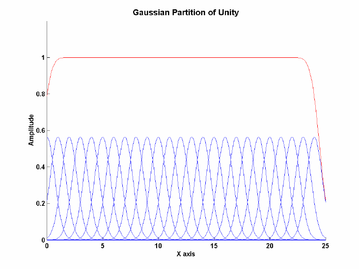

---
fontfamily: "libertine"
mainfont: "GFS Artemisa"
title: "General Relativity"
author: [Tae Geun Kim]
date: 2018-08-24
subject: "Markdown"
keywords: [Markdown, Example]
subtitle: "By precise approach"
titlepage: true
...

\newpage\null\thispagestyle{empty}\newpage

# Preliminaries

## Manifolds

### 1. Topological Manifolds

\begin{tcolorbox}[colback=white!5!white,colframe=white!50!black, title=\textbf{Def 1.1 } Topological Manifolds]
  A \textit{manifold} $M$ of dimension $n$ is a topological space with the following properties.
  \begin{enumerate}
    \item $M$ is Hausdorff
    \item $M$ is locally Euclidean of dimension $n$
    \item $M$ has a countable basis of open sets
  \end{enumerate}
\end{tcolorbox}

**Why?**

* **Hausdorff** : In Hausdorff space, convergent sequences converge to only one point.
If you want to do calculus, you should need Hausdorff space.

* **Locally Euclidean** : This is the main reason that why we require manifolds.

* **Countable Basis** : We need *partition of unity* to bring many properties of Euclidean space.
For Hausdorff space, existence of partition of unity require *paracompactness*.
And paracompactness follows from *second countability*. It is same as have countable basis.

#### 1.1 Supplement

\begin{tcolorbox}[colback=white!5!white,colframe=white!50!black, title=\textbf{Thm 1.1.1 } Paracompact $\simeq$ Partition of unity]
  Let $(X, \tau)$ be a topological space that is $T_1$ (all points are closed). Then the following are equivalent:
  \begin{enumerate}[I.]
    \item $(X,\tau)$ is paracompact and Hausdorff
    \item Every open cover of $(X, \tau)$ admits a subordinate partition of unity
  \end{enumerate}
\end{tcolorbox}

To prove this, we need a wide background knowledge.

\vs

\begin{tcolorbox}[colback=white!5!white,colframe=white!50!black, title=\textbf{Def 1.1.2 } Hausdorff]
  Given points $x$ and $y$ of $S$, if $x\neq y$, then there exist open neighborhoods $U$ of $x$ and $V$ of $y$ in $S$
  that are disjoint: such that $U \cap V = \emptyset$.
\end{tcolorbox}

\vs

\begin{tcolorbox}[colback=white!5!white,colframe=white!50!black, title=\textbf{Def 1.1.3 } Locally finite cover]
  Let $(X, \tau)$ be a topological space.

  An open cover $\Mbk{U_i \subset X}_{i\in I}$ of $X$ is called \textit{locally finite} if $\forall x \in X$,
  there exists a neighbourhood $U_x \supset \Mbk{x}$ such that it intersects only finitely many elements of the cover,
  hence such that $U_x \cap U_i \neq \emptyset$ for only a finite number of $i\in I$.
\end{tcolorbox}

\begin{tcolorbox}[colback=white!5!white,colframe=white!50!black, title=\textbf{Def 1.1.4 } Refinement of open covers]
  Let $(X, \tau)$ be a topological space, and let $\Mbk{U_i \subset X}_{i \in I}$ be a open cover.
  Then a \textit{refinement} of this open cover is a set of open subsets $\Mbk{V_j \subset X}_{j\in J}$
  which is still an open cover in itself and such that for each $j\in J$ there exists an $i \in I$ with $V_j \subset U_i$.
\end{tcolorbox}

\begin{tcolorbox}[colback=white!5!white,colframe=white!50!black, title=\textbf{Def 1.1.5 } Paracompact topological space]
  A topological space $(X, \tau)$ is called \textit{paracompact} if every open cover of $X$
  has a refinement by a locally finite open cover.
\end{tcolorbox}

\begin{tcolorbox}[colback=white!5!white,colframe=white!50!black, title=\textbf{Def 1.1.6 } Partition of unity]
  Let $(X, \tau)$ be a topological space, and let $\Mbk{U_i \subset X}_{i\in I}$ be an open cover.
  Then a \textit{partition of unity} subordinate to the cover is

  \begin{itemize}
    \item a set $\Mbk{f_i}_{i \in I}$ of continuous functions
    \begin{equation*}
      f_i : X \rightarrow [0, 1]
    \end{equation*}
    (where $[0,1] \subset \mathbb{R}$ is equipped with the subspace topology of the real numbers
    $\mathbb{R}$ regarded as the 1D Euclidean space equipped with its metric topology)
  \end{itemize}
  such that with
  \begin{equation*}
    Supp(f_i) := Cl\Sbk{f_i^{-1}((0,1])}
  \end{equation*}
  denoting the support of $f_i$ (the topological closure of the
  subset of points on which it does not vanish) then
  
  \begin{enumerate}[1)]
    \item $\underset{i \in I}{\forall} (Supp(f_i) \subset U_i)$
    \item $\Mbk{Supp(f_i) \subset X}_{i\in I}$ is a locally finite cover
    \item $\underset{x \in X}{\forall} \Sbk{\sum_{i \in I}f_i(x) = 1}$
  \end{enumerate}
\end{tcolorbox}

\newpage

\begin{tcolorbox}[colback=white!5!white,colframe=white!50!black, title=\textbf{Prop 1.1.7 } Paracompact - Partition of unity]
  If $(X, \tau)$ is a paracompact topological space, then for every open cover $\Mbk{U_i \subset X}_{i\in I}$
  there is a subordinate partition of unity.
\end{tcolorbox}

Proof will be given later.

\begin{tcolorbox}[colback=white!5!white,colframe=white!50!black, title=\textbf{Lem 1.1.8 } Natural Refinement]
  Let $(X, \tau)$ be a topological space, $\Mbk{U_i \subset X}_{i \in I}$ be an open cover
  and $\Sbk{\phi : J \rightarrow I, ~ \Mbk{V_j \subset X}_{j\in J}}$ be a refinement to a locally finite cover. 
  Then, for $\Mbk{W_i \subset X}_{i \in I}$ with
  \begin{equation*}
    W_i \equiv \Mbk{\bigcup_{j \in \phi^{-1}(\Mbk{i})} V_j}
  \end{equation*}
  is still a refinement of $\Mbk{U_i \in X}_{i \in I}$ to a locally finite cover.
\end{tcolorbox}

\begin{tcolorbox}[colback=red!5!white,colframe=red!50!white, title=\textbf{Proof for 1.1.8 }]
  First we know, for $V$, $V_j \subset U_{\phi(j)=i}$.
  Conversely, $\forall j \in \phi^{-1}(\Mbk{i}), \; V_j \subset U_i$.
  Thus, $W_i \in \bigcup_{j\in\phi^{-1}(\Mbk{i})} V_j \subset U_i$.
  \newline

  Second, since $\Mbk{V_j \subset X}_{j \in J}$ are locally finite,
  $\exists ~\mathcal{U}_x \supset \Mbk{x}$ and a finite subset $K \subset J$ such that

  \begin{equation*}
    \underset{j \in J \backslash K}{\forall}\Sbk{
      \mathcal{U}_x \cap V_j = \emptyset}
  \end{equation*}

  (locally finite: $\mathcal{U}_x \cap V_j \neq \emptyset$ for just finite number of $j \in J$)

  Then we can get by construction,

  \begin{equation*}
    \underset{i \in I\backslash \phi(K)}{\forall}\Sbk{\mathcal{U}_x \cap W_i = \emptyset}
  \end{equation*}

  Since $\phi(K)$ is still finite, we can find the number of $i$ such that $\mathcal{U}_x \cap W_i = \emptyset$ is also finite.
  (If for $i \in K',~$ $\mathcal{U}_x \cap W_i = \emptyset$ then $K'$ should be subset of $\phi(K)$.)
  \newline

  Therefore $\Mbk{W_i \in X}_{i \in I}$ is locally finite.
\end{tcolorbox}

\vs 

\begin{tcolorbox}[colback=white!5!white,colframe=white!50!black, title=\textbf{Lem 1.1.9 } Shrinking Lemma]
  Let $X$ be a topological space which is normal and let $\Mbk{U_i \subset X}_{i\in I}$ be a locally finite open cover.
  Assuming the axiom of choice then:
  \newline

  There exists another open cover $\Mbk{V_i \subset X}_{i \in I}$ such that the topological closure
  $Cl(V_i)$ of its elements is contained in the original patches:

  \begin{equation*}
    \underset{i \in I}{\forall}\Sbk{V_i \subset Cl(V_i) \subset U_i}
  \end{equation*}
\end{tcolorbox}

\newpage

Now, suggest some fundamental topological concepts to prove prop 1.1.7.

\begin{tcolorbox}[colback=white!5!white,colframe=white!50!black, title=\textbf{Def 1.1.10 } Normal Spaces ($T_4$)]
  A topological space $X$ is \textit{normal} if for every two closed disjoint subsets $A,B \subset X$, there are neighborhoods $U \supset A$, $~ V \supset B$ such that $U \cap V = \emptyset$.
\end{tcolorbox}

\vs

\begin{tcolorbox}[colback=white!5!white,colframe=white!50!black, title=\textbf{Prop 1.1.11 } $T_4$ in terms of topological closure]
  $X$ is normal iff for all closed subsets $C \subset X$ with open neighborhood $U \supset C$ there exists a smaller open neighborhood $V\supset C$ whose topological closure $Cl(V)$ is still contained in $U$:
  $$ C \subset V \subset Cl(V) \subset U$$
\end{tcolorbox}

\begin{tcolorbox}[colback=white!5!white,colframe=red!50!white, title=\textbf{Proof for Prop 1.1.11 }]
  Suppose that $(X, \tau)$ is $T_4$.
  Consider closed subset $C \subset U$ where $U$ is open neighborhood of $C$. It implies
  $$ C \cap X\backslash U = \emptyset $$
  Since $U$ is open, $X \backslash U$ is closed. Because of normal space, there are open neighborhoods $V,W$ such that $C \subset V$, $~ X\backslash U \subset W$ and $V \cap W = \emptyset$. Because of last term, we can find $V \subset X \backslash W \subset U$. 
  Since $X \backslash W$ is closed, we can find next relation :
  $$ C \subset V \subset Cl(V) \subset X \backslash W \subset U$$

  In the other direction, suppose that $\forall$ open neighborhood $U$ of closed subset $C$,
  there are smaller open neighborhood with $C \subset V \subset Cl(V) \subset U$. 
  Now, consider disjoint closed subset $C_1, C_2 \subset X$.
  $C_1 \cap C_2 = \emptyset$ implies $C_1 \subset X\backslash C_2$.
  Since $X \backslash C_2$ is open neighborhood of $C_1$, there exists smaller open neighborhood $V$ such that
  $$ C_1 \subset V \subset Cl(V) \subset X \backslash C_2$$
  And it also implies $X\backslash Cl(V)$ is open neighborhood of $C_2$ where $V \cap X\backslash Cl(V) = \emptyset$.

  Therefore $X$ is $T_4$.
\end{tcolorbox}

\newpage

\begin{tcolorbox}[colback=white!5!white,colframe=white!50!black, title=\textbf{Def 1.1.12 } Urysohn function]
  Let $X$ be a topological space, and let $A,B \subset$ X be disjoint closed subsets. Then an \textit{Urysohn function} for this situation is a continuous function $$f: X\rightarrow [0,1]$$ to the closed interval equipped with its Euclidean metric topology, such that
  $$ f(A) = \Mbk{0} ~ \text{and} ~ f(B) = \Mbk{1} $$
\end{tcolorbox}

\vs

\begin{tcolorbox}[colback=white!5!white,colframe=white!50!black, title=\textbf{Prop 1.1.13 } Urysohn's Lemma]
  Let $X$ be a normal topological space, and let $A, B \subset X$ be two disjoint closed subsets of $X$. Then there exists an \textit{Urysohn function}.
\end{tcolorbox}

This lemma has several **big** applications:

* **Urysohn Metrization Thm**: *If $X$ is a normal space with a countable basis, then we can use the abundance of continuous functions from $X$ to $[0,1]$ to assign numerical coordinates to the points of $X$ and obtain an embedding of $X$ into $\R^{\omega}$. From this we see that every second countable normal space is a metric space.*

* **Tietze Extension Thm**: *Suppose $A$ is a subset of a space $X$ and $f: A \rightarrow [0,1]$ is a continuous function. If $X$ is normal and $A$ is closed in $X$, then we can find a continuous function from $X$ to $[0,1]$ that is an extension of $f$.*

* **Embedding manifolds in $\mathbb{R}^n$**: Using Urysohn's lemma to develop the tool called *partitions of unity*, we can obtain the following theoerem:
  *Each compact $n$-manifold is homeomorphic to a subspace of some $\R^n$.*

Then let's start to prove *Urysohn's lemma*.

\newpage

\begin{tcolorbox}[colback=white!5!white,colframe=red!50!white, title=\textbf{Proof for Urysohn's lemma}]

$(\Leftarrow)$ Suppose $f(A) = \Mbk{0}, ~ f(B) = \Mbk{1}$ for all closed subset $A,B \subset X$.
Then $A \subset f^{-1}\Sbk{[0,\frac{1}{2})}$ and $D \subset f^{-1}\Sbk{(\frac{1}{2}, 1]}$.
We can find these two sets are open and disjoint. 

\end{tcolorbox}
