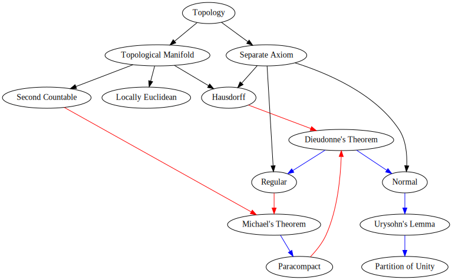

---
fontfamily: "libertine"
mainfont: "GFS Artemisa"
title: "General Relativity"
author: [Tae Geun Kim]
date: 2018-09-18
subject: "Markdown"
keywords: [Markdown, Example]
subtitle: "By precise approach"
titlepage: true
...

\newpage\thispagestyle{empty}\null\newpage

# The Background Manifold Structure

## 1. Topological Manifolds

\begin{tcolorbox}[colback=white!5!white,colframe=white!60!blue, title=\textbf{Def 1.1 \hs Topological Manifolds}]
  A \textit{manifold} $M$ of dimension $n$ is a topological space with the following properties.
  \begin{enumerate}
    \item $M$ is Hausdorff
    \item $M$ is locally Euclidean of dimension $n$
    \item $M$ has a countable basis of open sets
  \end{enumerate}
\end{tcolorbox}

**Why?**

* **Hausdorff** : In Hausdorff space, convergent sequences converge to only one point.
If you want to do calculus, you should need Hausdorff space.

* **Locally Euclidean** : This is the main reason that why we require manifolds.

* **Countable Basis** : We need *partition of unity* to bring many properties of Euclidean space.
For Hausdorff space, existence of partition of unity require *paracompactness*.
And paracompactness follows from *second countability*. It is same as have countable basis.

\VS

Now, we need some topological concepts to start *General Relativity*.
If you are not familiar with topology, first read *Appendix A*.

\newpage

## 2. Topological concepts

### 1) Basic Concepts

\begin{tcolorbox}[colback=white!5!white,colframe=white!60!blue, title=\textbf{Def 2.1.1 \hs Connected}]
  If it is not possible to write $M = A \cup B$ with, $A,B \in \mathcal{T}$ and $A \cup B = \emptyset$
  then $M$ is \textit{connected}.
\end{tcolorbox}

\vs

\begin{tcolorbox}[colback=white!5!white,colframe=white!60!blue, title=\textbf{Def 2.1.2 \hs Hausdorff}]
  If $M$ is connected \& $\forall \, p, q \in M$, there are open neighborhoods $\mcu(p) \ni p$, $\mcu(q) \ni q$
  such that $\mcu(p) \cap \mcu(q) = \emptyset$ then $M$ is \textit{Hausdorff}.
\end{tcolorbox}

\vs

\begin{tcolorbox}[colback=white!5!white,colframe=white!60!blue, title=\textbf{Def 2.1.3 \hs Cover}]
  A family $\Mbk{\mcu_\alpha}_{\alpha \in A}$ of open sets of $M$ is called \textit{open cover of $M$} if 
  $$\bigcup_{\alpha \in A}\mcu_\alpha = M$$
\end{tcolorbox}

\vs

\begin{tcolorbox}[colback=white!5!white,colframe=white!60!blue, title=\textbf{Def 2.1.4 \hs Compact}]
  $M$ is \textit{compact} if $M$ is Hausdorff and all open cover of $M$ has finite refinement of $M$.
\end{tcolorbox}

\vs

\begin{tcolorbox}[colback=white!5!white,colframe=white!60!blue, title=\textbf{Def 2.1.5 \hs Paracompact}]
  $M$ is \textit{paracompact} if all open cover of $M$ has locally finite refinement.
\end{tcolorbox}

### 2) Maps

\begin{tcolorbox}[colback=white!5!white,colframe=white!60!blue, title=\textbf{Def 2.2.1 \hs Important Maps}]
  Given two sets $U, U'$ a map $\Phi: U \rightarrow U'$ is called
  \begin{itemize}
    \item \textit{Injective} : $\forall p' \in \Phi(U)$, $~ \exists! p \in U$ such that $\Phi(p) = p'$.
    \item \textit{Surjective} : $\Phi(U) = U'$.
    \item \textit{Bijective} : $\Phi$ is both injective and surjective.
  \end{itemize}
\end{tcolorbox}

\begin{tcolorbox}[colback=white!5!white,colframe=white!60!blue, title=\textbf{Def 2.2.2 \hs Continuous}]
  Consider $(U, \mathcal{T}),~(U', \mathcal{T}')$ are topological spaces.
  $\Phi: U \rightarrow U'$ is said to be \textit{continuous} at a point $p \in U$
  if $\Phi^{-1}(W')$ is a neighborhood of $p$ for any neighborhood $W'$ of
  $\Phi(p) \in U'$.
\end{tcolorbox}

\newpage

\begin{tcolorbox}[colback=white!5!white,colframe=white!60!blue, title=\textbf{Def 2.2.3 \hs Homeomorphism}]
  If $\Phi : U \rightarrow U'$ is bijective and $\Phi, \Phi^{-1}$ are continuous
  then $\Phi$ is called homeomorphism and $U,U'$ are homeomorphic.
\end{tcolorbox}

### 3) Coordinate Neighborhoods (Chart)

\begin{tcolorbox}[colback=white!5!white,colframe=white!60!blue, title=\textbf{Def 2.3.1 \hs Coordinate Neighborhood (Chart)}]
  Given a topological space $(M, \mathcal{T})$, define \textit{chart} of $M$ to be a pair $(\mcu_\alpha, \varphi_\alpha)$,
  with $\mcu_\alpha$ an element of $\mathcal{T}$ and $\varphi_\alpha$ a homeomorphism of $\mcu_\alpha$
  onto an open set of $\R^n$.
\end{tcolorbox}

We usually use next notation:

\begin{itemize}
  \item \textit{Point on a manifold} : $p \in M$
  \item \textit{Local coordinate of point} : $\varphi(p) = (x^1, \cdots, x^n) = x$
\end{itemize}

\begin{tcolorbox}[colback=white!5!white,colframe=white!60!blue, title=\textbf{Def 2.3.2 \hs Atlas}]
  A familiy of charts $\mathcal{A} = \Mbk{(\mcu_\alpha, \varphi_\alpha)}_{\alpha \in A}$ on $M$
  is said to form an \textit{atlas} on $M$ if $\displaystyle\bigcup_{\alpha \in A}\mcu_\alpha = M$.
\end{tcolorbox}

\vs

\begin{tcolorbox}[colback=white!5!white,colframe=white!60!blue, title=\textbf{Def 2.3.3 \hs Coordinate Transform}]
  Let $(\mcu_\alpha, \varphi_\alpha),~(\mcu_\beta, \varphi_\beta)$ be two charts on $M$
  with $\mcu_\alpha \cap \mcu_\beta = \emptyset$. For a point $p \in \mcu_\alpha \cap \mcu_\beta$,
  a map (trivial homeomorphism) 
  $$\varphi_\beta \cdot \varphi_\alpha^{-1}:~\varphi_\alpha(\mcu_\alpha \cap \mcu_\beta) \rightarrow \varphi_\beta (\mcu_\alpha \cap \mcu_\beta)$$
  is called \textit{Coordinate Transform}.
\end{tcolorbox}

\vs

\begin{tcolorbox}[colback=white!5!white,colframe=white!60!blue, title=\textbf{Def 2.3.4 \hs $\mathbf{C^r}$-atlas}]
  An atlas on $M$ is $C^r\textit{-atlas}$ if $\varphi_\beta \circ \varphi_\alpha^{-1}$ and its inverse for any pair $(\alpha, \beta)$
  are $\R^n$ valued $C^r$-functions.
\end{tcolorbox}

\newpage

### 4) Differentiable Manifolds

\begin{tcolorbox}[colback=white!5!white,colframe=white!60!blue, title=\textbf{Def 2.4.1 \hs Differentiable Manifold}]
  \textit{Differentiable Manifold} of class $C^r$ and dimension $n$ is a Hausdorff topological space
  with a $C^r$-atlas.
\end{tcolorbox}

We denote differentiable manifold as $(M, \mathcal{A})$ where $\mathcal{A}$ is $C^r$-atlas.

[comment]: <> (==============================================================)
[comment]: <> (= Appendix )
[comment]: <> (==============================================================)

# Appendix

## A. Topology

### 1. Topological Spaces

\begin{tcolorbox}[colback=white!5!white,colframe=white!60!blue, title=\textbf{Def A.1.1 \hs Topological Space}]

A \textit{topology} on a set $X$ is a subset $\mathcal{T}$ of the power set $\mathcal{P}(X)$ with the following properties:

\begin{enumerate}[1.]
  \item $\emptyset \in \mathcal{T}$ and $X \in \mathcal{T}$
  \item Unions of elements of $\mathcal{T}$ belong to $\mathcal{T}$
  $$ U_i \in \mathcal{T} ~ \text{for all} ~ i \in I~\Longrightarrow ~ \bigcup_{i\in I} U_i \in \mathcal{T}$$
  \item Intersections of finitely many elements of $\mathcal{T}$ belong to $\mathcal{T}$. For finite set $I$,
  $$ U_i \in \mathcal{T} ~ \text{for all} ~ i \in I~\Longrightarrow ~ \bigcap_{i\in I} U_i \in \mathcal{T}$$
\end{enumerate}

A \textit{topological space} is a set $X$ together with a topology $\mathcal{T}$ on $X$. For a topological space $(X, \mathcal{T})$,
we call the elements of $\mathcal{T}$ \textit{open subsets} and their complements \textit{closed subsets} of $X$.

\end{tcolorbox}

\vs

\begin{tcolorbox}[colback=white!5!white,colframe=white!60!blue, title=\textbf{Example A.1.2}]
  \begin{enumerate}[1)]
    \item Let $X$ be a set. Then $\mathcal{T} = \Mbk{\emptyset, X}$, is a topology on $X$,
    called the \textit{trivial topology}. This is a smallest topology.
    \item The power set $\mathcal{P}(X)$ of a set $X$, is a topology on $X$,
    called the \textit{discrete topology}. This is a largest topology.
  \end{enumerate}
\end{tcolorbox}

\VS

**Exercise A.1**: Prove *Example A.2*.

\newpage 

\begin{tcolorbox}[colback=white!5!white,colframe=white!60!blue, title=\textbf{Def A.1.3 \hs Basis}]
  Let $\mathcal{T}$ be a topology on a set $X$. A subset $\mathcal{B} \subseteq \mathcal{T}$
  is called a \textit{basis} for $\mathcal{T}$ if every element of $\mathcal{T}$ is a union of elements of $\mathcal{B}$.
\end{tcolorbox}

\vs

\begin{tcolorbox}[colback=white!5!white,colframe=white!60!blue, title=\textbf{Prop A.1.4 \hs Basis (Comfortable Definition)}]
  A subset $\mathcal{B}$ of a topology $\mathcal{T}$ on a set $X$ is a basis of $\mathcal{T}$
  iff, for every $U \in \mathcal{T}$ and $x \in U$, there is a $V \in \mathcal{B}$ with $x \in V \subseteq U$.
\end{tcolorbox}

Proof is trivial.

\vs

\begin{tcolorbox}[colback=white!5!white,colframe=white!60!blue, title=\textbf{Def A.1.5 \hs Neighborhood}]
  Let $X$ be a topological space, $x \in X$. Then $U \subseteq X$ is called a
  \textit{neighborhood} of $x$ when there is an open set $x \in V \subseteq U$.
  We denote by $\mathcal{U}(x)$ the set of all neighborhoods of $x$.
\end{tcolorbox}

\vs

\begin{tcolorbox}[colback=white!5!white,colframe=white!60!blue, title=\textbf{Def A.1.6 \hs Neighborhood Basis}]
  Let $X$ be a topological space and $x \in X$. Then we call a subset $\mathcal{B}(x) \subseteq \mathcal{U}(x)$
  a \textit{neighborhood basis} of $x$
  if for every neighborhood $U$ of $x$, there is a $V \in \mathcal{B}(x)$ with $V \subseteq U$.
\end{tcolorbox}

\vs

\begin{tcolorbox}[colback=white!5!white,colframe=white!60!blue, title=\textbf{Def A.1.7 \hs Countability}]
  Let $X$ be a topological space.
  \begin{itemize}
    \item $X$ satisfies the \textit{first countability axiom} and is called \textit{countable} if every point
    in $X$ admits a countable neighborhood basis.
    \item $X$ satisfies the \textit{second countability axiom} and is called \textit{second countable} if
    the topology of $X$ admits a countable basis.
  \end{itemize}
\end{tcolorbox}

\vs

\begin{tcolorbox}[colback=white!5!white,colframe=white!60!blue, title=\textbf{Def A.1.8 \hs Adherent, Interior and Boundary}]
  Let X be a topological space and $Y \subseteq X$. Then $x \in X$ is called
  \begin{enumerate}[1.]
    \item \textit{an adherent point} (also sometimes called a \textit{point of closure}) of $Y$, 
    if every neighborhood of $x$ in $X$ contains a point of $Y$. The set $Y$ of adherent points of $Y$
    is called the \textit{closure} of $Y$

    \item \textit{an interior point} of $Y$ if there is a neighborhood of $x$ in $X$ that is contained in $Y$.
    The set $\mathring{Y}$ of interior points of $Y$ is called the \textit{interior} of $Y$

    \item \textit{a boundary point} of $Y$ if every neighborhood of $x$ in $X$ contains points of $Y$ and
    $X \backslash Y$. The set of boundary points of $Y$ is called the \textit{boundary} of $Y$, here denoted
    by $\partial Y$.
  \end{enumerate}
\end{tcolorbox}

\newpage

### 2. Continous Maps

\begin{tcolorbox}[colback=white!5!white,colframe=white!60!blue, title=\textbf{Def A.2.1 \hs Continuous}]
  Let $(X,\tau)$ and $(Y, \tau')$ be topological spaces and $f: X \rightarrow Y$ be a function. We call $f$
  \textit{continuous} if $f^{-1}(V) \in \tau$ for all $V \in \tau'$.
\end{tcolorbox}

\vs

\begin{tcolorbox}[colback=white!5!white,colframe=white!60!blue, title=\textbf{Def A.2.2 \hs Continuous at a point}]
  Let $(X,\tau)$ and $(Y, \tau')$ be topological spaces and $f: X \rightarrow Y$ be a function. We call $f$
  \textit{continuous at a point} $x \in X$ if, for every neighborhood $V$ of $f(x) \in Y$, there is a neighborhood
  $U$ of $x$ with $f(U) \subseteq V$.
\end{tcolorbox}

\vs

\begin{tcolorbox}[colback=white!5!white,colframe=white!60!blue, title=\textbf{Def A.2.3 \hs Homeomorphism}]
  A map $f: X \rightarrow Y$ between topological spaces $X$ and $Y$ is called a \textit{homeomorphism}
  if $f$ is bijective and $f$ and $f^{-1}$ are continuous.
\end{tcolorbox}

### 3. Convergence And Hausdorff Spaces

\begin{tcolorbox}[colback=white!5!white,colframe=white!60!blue, title=\textbf{Def A.3.1 \hs Convergence}]
  Let $X$ be a topological space and $(x_n)$ a sequence in $X$. Then a point $x\in X$ is called
  a \textit{limit} of the sequence $(x_n)$ if, for every neighborhood $\mathcal{U}(x)$ of $x$, 
  $~\exists n \in \mathbb{N}$ such that $x_m \in \mathcal{U}(x), ~ \forall m \geq n$.
  We then say that the sequence \textit{converges to} $x$, and we call the sequence \textit{convergent}.
\end{tcolorbox}

\vs

\begin{tcolorbox}[colback=white!5!white,colframe=white!60!blue, title=\textbf{Def A.3.2 \hs Hausdorff}]
  Given points $x$ and $y$ of $S$, if $x\neq y$, then there exist open neighborhoods $U$ of $x$ and $V$ of $y$ in $S$
  that are disjoint: such that $U \cap V = \emptyset$.
\end{tcolorbox}

**Exercise A.2**: Prove that Metric spaces are Hausdorff spaces.

\newpage

\begin{tcolorbox}[colback=white!5!white,colframe=white!60!blue, title=\textbf{Prop A.3.3 \hs Hausdorff and Convergence}]
  Let $X$ be a Hausdorff space. Then limit of sequences in $X$ are unique if they exist.
\end{tcolorbox}

\vs

**Exercise A.3**: Prove *prop A.3.3*.

\begin{tcolorbox}[colback=white!5!white,colframe=white!60!blue, title=\textbf{Def A.3.4 \hs Regular Hausdorff ($\mathbf{T_3}$)}]
  Let $X$ be a topological space. $X$ is called \textit{regular} if given any point $x$ and closed set
  $C$, if $x \notin C$, then there exist a neighborhood $\mathcal{U}(x)$ of $x$ and a neighborhood $\mcu(C)$ of $C$
  such that $\mathcal{U}(x) \cap \mcu(C) = \emptyset$. 
\end{tcolorbox}

\newpage

### 4. Understand Necessarity of Second Countability in Manifold

\begin{tcolorbox}[colback=white!5!white,colframe=white!60!blue, title=\textbf{Thm A.4.1 \hs Paracompact $\simeq$ Partition of unity}]
  Let $(X, \tau)$ be a topological space that is $T_1$ (all points are closed). Then the following are equivalent:
  \begin{itemize}
    \item $(X,\tau)$ is paracompact and Hausdorff
    \item Every open cover of $(X, \tau)$ admits a subordinate partition of unity
  \end{itemize}
\end{tcolorbox}

To prove this, we need a wide background knowledge.

\VS

\VS

\newpage

\begin{tcolorbox}[colback=white!5!white,colframe=white!60!blue, title=\textbf{Def A.4.2 \hs Hausdorff}]
  Given points $x$ and $y$ of $S$, if $x\neq y$, then there exist open neighborhoods $U$ of $x$ and $V$ of $y$ in $S$
  that are disjoint: such that $U \cap V = \emptyset$.
\end{tcolorbox}

\begin{tcolorbox}[colback=white!5!white,colframe=white!60!blue, title=\textbf{Def A.4.3 \hs Locally finite cover}]
  Let $(X, \tau)$ be a topological space.

  An open cover $\Mbk{U_i \subset X}_{i\in I}$ of $X$ is called \textit{locally finite} if $\forall x \in X$,
  there exists a neighbourhood $U_x \supset \Mbk{x}$ such that it intersects only finitely many elements of the cover,
  hence such that $U_x \cap U_i \neq \emptyset$ for only a finite number of $i\in I$.
\end{tcolorbox}

\begin{tcolorbox}[colback=white!5!white,colframe=white!60!blue, title=\textbf{Def A.4.4 \hs Refinement of open covers}]
  Let $(X, \tau)$ be a topological space, and let $\Mbk{U_i \subset X}_{i \in I}$ be a open cover.
  Then a \textit{refinement} of this open cover is a set of open subsets $\Mbk{V_j \subset X}_{j\in J}$
  which is still an open cover in itself and such that for each $j\in J$ there exists an $i \in I$ with $V_j \subset U_i$.
\end{tcolorbox}

\begin{tcolorbox}[colback=white!5!white,colframe=white!60!blue, title=\textbf{Def A.4.5 \hs Paracompact topological space}]
  A topological space $(X, \tau)$ is called \textit{paracompact} if every open cover of $X$
  has a refinement by a locally finite open cover.
\end{tcolorbox}

\begin{tcolorbox}[colback=white!5!white,colframe=white!60!blue, title=\textbf{Def A.4.6 \hs Partition of unity}]
  Let $(X, \tau)$ be a topological space, and let $\Mbk{U_i \subset X}_{i\in I}$ be an open cover.
  Then a \textit{partition of unity} subordinate to the cover is

  \begin{itemize}
    \item a set $\Mbk{f_i}_{i \in I}$ of continuous functions
    \begin{equation*}
      f_i : X \rightarrow [0, 1]
    \end{equation*}
    (where $[0,1] \subset \mathbb{R}$ is equipped with the subspace topology of the real numbers
    $\mathbb{R}$ regarded as the 1D Euclidean space equipped with its metric topology)
  \end{itemize}
  such that with
  \begin{equation*}
    Supp(f_i) := Cl\Sbk{f_i^{-1}((0,1])}
  \end{equation*}
  denoting the support of $f_i$ (the topological closure of the
  subset of points on which it does not vanish) then

  \begin{enumerate}[1)]
    \item $\underset{i \in I}{\forall} (Supp(f_i) \subset U_i)$
    \item $\Mbk{Supp(f_i) \subset X}_{i\in I}$ is a locally finite cover
    \item $\underset{x \in X}{\forall} \Sbk{\sum_{i \in I}f_i(x) = 1}$
  \end{enumerate}
\end{tcolorbox}

\begin{tcolorbox}[colback=white!5!white,colframe=white!60!blue, title=\textbf{Prop A.4.7 \hs Paracompact - Partition of unity}]
  If $(X, \tau)$ is a paracompact topological space, then for every open cover $\Mbk{U_i \subset X}_{i\in I}$
  there is a subordinate partition of unity.
\end{tcolorbox}

Proof will be given later.

\newpage

\begin{tcolorbox}[colback=white!5!white,colframe=white!60!blue, title=\textbf{Lem A.4.8 \hs Natural Refinement}]
  Let $(X, \tau)$ be a topological space, $\Mbk{U_i \subset X}_{i \in I}$ be an open cover
  and $\Sbk{\phi : J \rightarrow I, ~ \Mbk{V_j \subset X}_{j\in J}}$ be a refinement to a locally finite cover.
  Then, for $\Mbk{W_i \subset X}_{i \in I}$ with
  \begin{equation*}
    W_i \equiv \Mbk{\bigcup_{j \in \phi^{-1}(\Mbk{i})} V_j}
  \end{equation*}
  is still a refinement of $\Mbk{U_i \subset X}_{i \in I}$ to a locally finite cover.
\end{tcolorbox}

\begin{tcolorbox}[colback=red!5!white,colframe=red!50!white, title=\textbf{Proof for A.4.8 }]
  First we know, for $V$, $V_j \subset U_{\phi(j)=i}$.
  Conversely, $\forall j \in \phi^{-1}(\Mbk{i}), \; V_j \subset U_i$.
  Thus, $W_i \in \bigcup_{j\in\phi^{-1}(\Mbk{i})} V_j \subset U_i$.
  \newline

  Second, since $\Mbk{V_j \subset X}_{j \in J}$ are locally finite,
  $\exists ~\mathcal{U}_x \supset \Mbk{x}$ and a finite subset $K \subset J$ such that

  \begin{equation*}
    \underset{j \in J \backslash K}{\forall}\Sbk{
      \mathcal{U}_x \cap V_j = \emptyset}
  \end{equation*}

  (locally finite: $\mathcal{U}_x \cap V_j \neq \emptyset$ for just finite number of $j \in J$)

  Then we can get by construction,

  \begin{equation*}
    \underset{i \in I\backslash \phi(K)}{\forall}\Sbk{\mathcal{U}_x \cap W_i = \emptyset}
  \end{equation*}

  Since $\phi(K)$ is still finite, we can find the number of $i$ such that $\mathcal{U}_x \cap W_i \neq \emptyset$ is also finite.
  (If for $i \in K',~$ $\mathcal{U}_x \cap W_i \neq \emptyset$ then $K'$ should be subset of $\phi(K)$.)
  \newline

  Therefore $\Mbk{W_i \subset X}_{i \in I}$ is locally finite.
\end{tcolorbox}

\vs

\begin{tcolorbox}[colback=white!5!white,colframe=white!60!blue, title=\textbf{Lem A.4.9 \hs Shrinking Lemma}]
  Let $X$ be a topological space which is normal and let $\Mbk{U_i \subset X}_{i\in I}$ be a locally finite open cover.
  Assuming the axiom of choice then:
  \newline

  There exists another open cover $\Mbk{V_i \subset X}_{i \in I}$ such that the topological closure
  $Cl(V_i)$ of its elements is contained in the original patches:

  \begin{equation*}
    \underset{i \in I}{\forall}\Sbk{V_i \subset Cl(V_i) \subset U_i}
  \end{equation*}
\end{tcolorbox}

\newpage

Now, suggest some fundamental topological concepts to prove prop A.4.7.

\VS

\begin{tcolorbox}[colback=white!5!white,colframe=white!60!blue, title=\textbf{Def A.4.10 \hs Normal Spaces ($\mathbf{T_4}$)}]
  A topological space $X$ is \textit{normal} if for every two closed disjoint subsets $A,B \subset X$, there are neighborhoods $U \supset A$, $~ V \supset B$ such that $U \cap V = \emptyset$.
\end{tcolorbox}

\vs

\begin{tcolorbox}[colback=white!5!white,colframe=white!60!blue, title=\textbf{Prop A.4.11 \hs $\mathbf{T_4}$ in terms of topological closure}]
  $X$ is normal iff for all closed subsets $C \subset X$ with open neighborhood $U \supset C$ there exists a smaller open neighborhood $V\supset C$ whose topological closure $Cl(V)$ is still contained in $U$:
  $$ C \subset V \subset Cl(V) \subset U$$
\end{tcolorbox}

\begin{tcolorbox}[colback=white!5!white,colframe=red!50!white, title=\textbf{Proof for Prop A.4.11 }]
  Suppose that $(X, \tau)$ is $T_4$.
  Consider closed subset $C \subset U$ where $U$ is open neighborhood of $C$. It implies
  $$ C \cap X\backslash U = \emptyset $$
  Since $U$ is open, $X \backslash U$ is closed. Because of normal space, there are open neighborhoods $V,W$ such that $C \subset V$, $~ X\backslash U \subset W$ and $V \cap W = \emptyset$. Because of last term, we can find $V \subset X \backslash W \subset U$.
  Since $X \backslash W$ is closed, we can find next relation :
  $$ C \subset V \subset Cl(V) \subset X \backslash W \subset U$$

  In the other direction, suppose that $\forall$ open neighborhood $U$ of closed subset $C$,
  there are smaller open neighborhood with $C \subset V \subset Cl(V) \subset U$.
  Now, consider disjoint closed subset $C_1, C_2 \subset X$.
  $C_1 \cap C_2 = \emptyset$ implies $C_1 \subset X\backslash C_2$.
  Since $X \backslash C_2$ is open neighborhood of $C_1$, there exists smaller open neighborhood $V$ such that
  $$ C_1 \subset V \subset Cl(V) \subset X \backslash C_2$$
  And it also implies $X\backslash Cl(V)$ is open neighborhood of $C_2$ where $V \cap X\backslash Cl(V) = \emptyset$.

  Therefore $X$ is $T_4$.
\end{tcolorbox}

\newpage

\begin{tcolorbox}[colback=white!5!white,colframe=white!60!blue, title=\textbf{Def A.4.12 \hs Urysohn function}]
  Let $X$ be a topological space, and let $A,B \subset$ X be disjoint closed subsets. Then an \textit{Urysohn function} for this situation is a continuous function $$f: X\rightarrow [0,1]$$ to the closed interval equipped with its Euclidean metric topology, such that
  $$ f(A) = \Mbk{0} ~ \text{and} ~ f(B) = \Mbk{1} $$
\end{tcolorbox}

\vs

\begin{tcolorbox}[colback=white!5!white,colframe=white!60!blue, title=\textbf{Prop A.4.13 \hs Urysohn's Lemma}]
  Let $X$ be a normal topological space, and let $A, B \subset X$ be two disjoint closed subsets of $X$. Then there exists an \textit{Urysohn function}.
\end{tcolorbox}

This lemma has several **big** applications:

* **Urysohn Metrization Thm**: *If $X$ is a normal space with a countable basis, then we can use the abundance of continuous functions from $X$ to $[0,1]$ to assign numerical coordinates to the points of $X$ and obtain an embedding of $X$ into $\R^{\omega}$. From this we see that every second countable normal space is a metric space.*

* **Tietze Extension Thm**: *Suppose $A$ is a subset of a space $X$ and $f: A \rightarrow [0,1]$ is a continuous function. If $X$ is normal and $A$ is closed in $X$, then we can find a continuous function from $X$ to $[0,1]$ that is an extension of $f$.*

* **Embedding manifolds in $\mathbb{R}^n$**: Using Urysohn's lemma to develop the tool called *partitions of unity*, we can obtain the following theoerem:
  *Each compact $n$-manifold is homeomorphic to a subspace of some $\R^n$.*

\VS

Then let's start to prove *Urysohn's lemma*.

\newpage

\begin{tcolorbox}[colback=white!5!white,colframe=red!50!white, title=\textbf{Proof for Urysohn's lemma}]

$(\Leftarrow)$ Suppose $f(A) = \Mbk{0}, ~ f(B) = \Mbk{1}$ for all closed subset $A,B \subset X$.
Then $A \subset f^{-1}\Sbk{[0,\frac{1}{2})}$ and $D \subset f^{-1}\Sbk{(\frac{1}{2}, 1]}$.
We can find these two sets are open and disjoint.\footnote[1]{this will be exercise.} Thus, $X$ is $T_4$.
\newline

$(\Rightarrow)$ Suppose that $X$ is $T_4$ and consider two disjoint closed sets $A,B \subset X$. Claim there is \textit{Urysohn function}. To prove this, we should construct continuous function such that $f(A) = \Mbk{0},~ f(B) = \Mbk{1}$. (Maybe it's a little bit tricky.)

Since $X$ is $T_4$, we can find open neighborhood for any closed subsets of $X$ such that satisfies \textit{prop A.4.11}. Then we can think next idea :
\newline

Let $\Mbk{U_p}_{p\in [0,1] \cap \mathbb{Q}}$ be a collection of open sets such that

$$ U_1 = X\backslash B, ~ A \subset U_0 \subset Cl(U_0) \subset U_1$$

For convenience, denote $Q = [0,1] \cap \mathbb{Q}$. Since $Q$ is countable, we can enumerate it as

$$ Q = \Mbk{p_n | n\in \mathbb{N}}$$

To be more clear, we are going to define by induction a collection $\Mbk{U_p | p \in Q}$ of open subsets with the property:

$$ p < q ~ \Rightarrow ~ Cl(U_p) \subset U_q$$

By definition of $U_p$, we know above property is satisfied when $p=0,~q=1$. Since $Cl(U_0)$ is also subset of $X$, by \textit{prop A.4.11}, we can construct $\Mbk{U_p}_{p\in Q}$ completely. Also add some conditions ( $p \in (-\infty,0)\cap \mathbb{Q} ~\Rightarrow~ U_p = \emptyset$, $~ p \in (1, \infty) \cap \mathbb{Q} ~\Rightarrow~ U_p = X$ ), then we can extend our collection to whole $\mathbb{Q}$. Now, we can define new set:

$$ \mathbb{Q}(x) \equiv \Mbk{p\in \mathbb{Q} | x \in U_p}$$

Then we can find $\mathbb{Q}(x)$ has lower bound $0$.\footnote[2]{this will be exercise}
Since $\mathbb{Q}(x)$ has a greatest lower bound, we can define $f: X \rightarrow [0,1]$ by

$$ f(x) = \inf \mathbb{Q}(x) = \inf \Mbk{p \in \mathbb{Q} | x \in U_p}$$

If we show $f$ satisfies ( \textit{\textcircled{1} $0\leq f(x) \leq 1$, \textcircled{2} $f$ is Urysohn function for $A,B$, \newline
\textcircled{3} $x \in Cl(U_p) \Rightarrow f(x) \leq p$, \textcircled{4} $x \notin U_p \Rightarrow f(x) \geq p$, \textcircled{5} $f$ is continuous} ) then proof is complete.

\end{tcolorbox}

\newpage

\begin{tcolorbox}[colback=white!5!white,colframe=red!50!white, title=\textbf{Proof for Urysohn's lemma} (Continued)]

\textcircled{1} $0 \leq f(x) \leq 1$

: It's trivial because of next property :
$$ f(x) =
\begin{cases}
1 & \forall p > 1 \\
\text{can't define} & \forall p < 0
\end{cases}
$$

\textcircled{2} $f$ \textit{is Urysohn function for $A, B$.}

: Since $A \subset U_0$, $~ \forall x \in A,~f(x) = 0$ and $B = X \backslash U_1$, $~\forall x \in B, ~ f(x) = \inf \Mbk{(1,\infty) \cap \mathbb{Q}}= 1$.
\newline

\textcircled{3} \textit{If $x \in Cl(U_p)$, then $f(x) \leq p$}

: Suppose $x \in Cl(U_p)$, then $x \in Cl(U_p) \subset U_q, ~ \forall q \in \mathbb{Q}, \; q > p$.
Thus,
$$(p, \infty) \cap \mathbb{Q} \subset \mathbb{Q}(x) ~\Rightarrow~ \inf \mathbb{Q}(x) \leq p$$

\textcircled{4} \textit{If $x \notin U_p$, then $f(x) \geq p$}

: Suppose $x \notin U_p$, then $x \notin U_q,~ \forall q \leq p$. Thus,
$$ (-\infty, p] \cap \mathbb{Q}(x) = \emptyset ~ \Rightarrow ~ p \leq \inf \mathbb{Q}(x)$$

\textcircled{5} \textit{$f$ is continuous.}

: Suppose $U = (a,b) \in \mathbb{R}$ such that $(a,b) \cap [0,1] \neq \emptyset$.
Claim $f^{-1}(U)$ is open. Suppose $x \in f^{-1}(U)$. It means $f(x) \in U = (a,b)$. Since $U$ is open, there are $p, q \in \mathbb{Q}$ such that $a < p < f(x) < q < b$. By \textcircled{3}, \textcircled{4}, we know $x \in U_q \backslash Cl(U_p)$ and $f(U_q\backslash Cl(U_p)) \subset (a,b)$.\footnote[3]{this will be exercise.}

Thus, we can find $\forall x \in f^{-1}(U)$, there are $p, q \in \mathbb{Q}$ such that $x \in U_q \backslash Cl(U_p) \subset f^{-1}(U)$. Since $U_q \backslash Cl(U_p)$ is open, $f^{-1}(U)$ is open.
Therefore, $f$ is continuous.
\newline

Proof is complete.
\end{tcolorbox}

To prove *prop A.4.7*, we should know relation between *Hausdorff* and *Normal*.

\newpage

\begin{tcolorbox}[colback=white!5!white,colframe=white!60!blue, title=\textbf{Prop A.4.14 \hs Dieudonn\'e's Theorem}]
  Every paracompact Hausdorff space is normal.
\end{tcolorbox}

\vs

\begin{tcolorbox}[colback=white!5!white,colframe=red!50!white, title=\textbf{Proof for Dieudonn\'e's Theorem}]
  Consider $(X, \tau)$ be a paracompact Hausdorff space. 

  \vs

  \textcircled{1} First, claim it is regular. To show this, $\forall x \in X,$ closed subset $C \subset X$ such that $x \notin C$, there are open neighborhoods
  $~\mathcal{U}(x) \ni x, ~ \mathcal{U}(C) \supset C$ such that $\mathcal{U}(x) \cap \mathcal{U}(C) = \emptyset$. Then let's start.

  Since $X$ is Hausdorff, 
  $$\forall c \in C, ~\exists \mathcal{U}_c(x) \ni x, ~ \mathcal{U}(c) \ni c ~ \text{such that} ~ \mcu_c(x) \cap \mcu(c) = \emptyset$$
  We can find $\Mbk{\mcu(c) \subset X}_{c \in C}$ is an open cover of $C$,
  thus $~\Mbk{\mcu(c) \subset X}_{c \in C} \cup X \backslash C~$ is an open cover of $X$.
  Because of paracompactness of $X$, every open cover has locally finite refinement. By \textit{lem A.4.8 (Natural refinement)},
  if there exists locally finite refinement, then there exists one with the same index set as the original cover.
  Thus, we can take locally finite refinement $\mathcal{W}(c)$ such that

  $$ \Mbk{\mathcal{W}(c) \subset \mcu(c) \subset X}_{c \in C}$$

  Since $\mcu(c)$ is open cover of $C$ and $\mathcal{W}(c)$ is refinement of $\mcu(c)$,
  $\bigcup_{c \in C}\mathcal{W}(c)$ is open neighborhood of $C$. Let it be denoted by $\mathcal{V}(C)$:

  $$ \mathcal{V}(C) = \bigcup_{c \in C}\mathcal{W}(c)$$

  \vs

  Now, because of locally finiteness of $\mathcal{W}(c)$, $~\forall x \in X$, there exists
  neighborhood $\mathcal{W}(x)$ and finite subset $K \subset C$ such that

  $$\underset{c \in C\backslash K}{\forall} \Sbk{\mathcal{W}(x) \cap \mathcal{W}(c)} = \emptyset $$

  Let's take new neighborhood of $x$ as follows :

  $$\mathcal{V}(x) \equiv \mathcal{W}(x) \cap \Sbk{\bigcap_{k \in K}\mcu_k(x)}$$

  Then we can find 
  
  $$\mathcal{V}(x) \cap \mathcal{V}(C) = \emptyset\footnote{this will be exercise (refer to \textcircled{2})}$$

\end{tcolorbox}

\begin{tcolorbox}[colback=white!5!white,colframe=red!50!white, title=\textbf{Proof for Dieudonn\'e's Theorem} (Continued)]
  \textcircled{2} Claim $(X, \mathcal{T})$ is normal. Then we should prove below proposition:
  $$ \forall \text{disjoint closed subsets} ~ C,D \subset X, ~ \exists \text{disjoint neighborhoods} ~ \mcu(C),~\mcu(D) \in \mathcal{T}$$
  By regularity of $(X, \mathcal{T})$, we have next proposition:
  $$ \forall c \in C, ~ \exists \text{disjoint neighborhoods} ~ \mcu(c) \ni c, ~ \mcu_c(D) \supset D $$
  Since $\Mbk{\mcu(c) \subset X}_{c \in C} \cup X \backslash C~$ is an open cover of $X$ and paracompactness of $X$,
  we can find locally finite refinement in same index:
  $$ \Mbk{\mathcal{W}(c) \subset \mcu(c) \subset X}_{c \in C} $$
  Then we can find new open neighborhood of $C$:
  $$ \mathcal{V}(C) = \bigcup_{c \in C} \mathcal{W}(c)$$
  By locally finiteness of $\mathcal{W}(c)$, $\forall d \in D$, $\exists$ an open neighborhood $\mathcal{W}(d)$
  and finite subset $K_d \subset C$ such that
  $$\underset{c\in C \backslash {K}_d}{\forall}\Sbk{\mathcal{W}(c) \cap \mathcal{W}(d) = \emptyset}$$
  So, let take new open neighborhood of $d \in D$,
  $$ \mathcal{V}(d) = \mathcal{W}(d) \cap \Sbk{\bigcap_{c \in K_d} \mcu_c(D)} \footnote{Finite intersection of opensets are open}$$
  then
  $$ \mathcal{V}(C) \cap \mathcal{V}(d) = \emptyset,~ ~\forall d \in D \footnote{For $c\in K_d,~ \mcu(c) \cap \mcu_c(D) = \emptyset$ and for $c \in X\backslash K_d, ~ \mathcal{V}(C) \cap \mathcal{V}(d) = \emptyset$}$$
  Therefore take new open neighborhood of $D$ as
  $$ \mathcal{V}(D) \equiv \bigcup_{d \in D}\mathcal{V}(d)$$
  then
  $$ \mathcal{V}(C) \cap \mathcal{V}(D) = \emptyset$$
\end{tcolorbox}

# Reference

\begin{itemize}
  \item Felice, F. De, and C. J. S. Clarke. \textit{Relativity on Curved Manifolds}. Cambridge University Press, 1990.
  \item Boothby, William Munger. \textit{An Introduction to Differentiable Manifolds and Riemannian Geometry}. Revised Second ed., vol. 120, Academic Press, 2010.
  \item Ballmann, Werner. \textit{Introduction to Geometry and Topology}. Birkh\"auser, 2018.
  \item nLab authors. \textit{Paracompact Hausdorff spaces equivalently admit subordinate partitions of unity}. \href{https://ncatlab.org/nlab/show/paracompact+Hausdorff+spaces+equivalently+admit+subordinate+partitions+of+unity}{nLab}, 2018.
  \item nLab authors. \textit{Paracompact Hausdorff spaces are normal}. \href{https://ncatlab.org/nlab/show/paracompact+Hausdorff+spaces+are+normal}{nLab}, 2018.
\end{itemize}